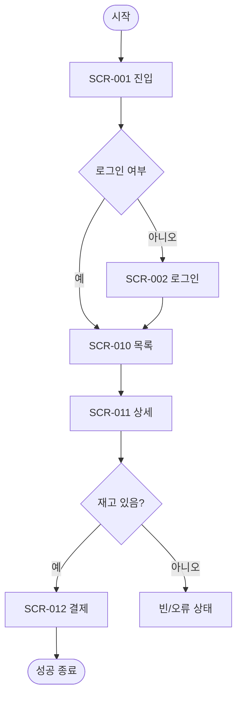

# 유저 플로우 템플릿 (User Flow Template)

> **용도**: 핵심 과업을 사용자가 완수하는 경로를 단계·분기·예외까지 정의한다. 화면 간 연결과 인터랙션의 기준이 된다.
> **사용 에이전트**: ux-research-lead(주), information-architecture-lead, ui-design-lead.
> **선행 산출물**: [`IA_Template.md`](IA_Template.md)
> **후속 산출물**: [`ScreenList_Template.md`](ScreenList_Template.md) · [`UX_Strategy_Template.md`](UX_Strategy_Template.md)
> **관련 GoldWiki**: [유저 플로우 가이드](../GoldWiki/UX/UserFlowGuide.md) · [12 유저 플로우](../GoldWiki/12_USER_FLOW.md) · [13 유저 여정](../GoldWiki/13_USER_JOURNEY.md)

### 사용 안내
- 플로우마다 **FLOW-ID**, 단계마다 **대응 화면ID**·**요구ID**를 표기한다.
- 정상 경로(Happy Path)와 예외(오류·빈 상태·이탈)를 모두 그린다.
- 시작 트리거와 성공 종료 조건을 명확히 한다.

---

## 1. 개요

| 항목 | 내용 |
|------|------|
| FLOW-ID | FLOW-001 |
| 플로우명 | {예: 회원가입 → 첫 구매} |
| 대상 사용자 | {페르소나} |
| 대응 요구ID | REQ-001, REQ-005 |
| 진입 트리거 | {} |
| 성공 종료 조건 | {} |
| 작성자 / 작성일 | {이름} / {YYYY-MM-DD} |

---

## 2. 플로우 다이어그램

---

## 3. 단계 정의 표 (추적)

| 단계 | 화면ID | 사용자 행동 | 시스템 반응 | 대응 요구ID | 검증 TC-ID |
|------|--------|-------------|-------------|-------------|------------|
| 1 | SCR-001 | {진입} | {} | REQ-001 | TC-001 |
| 2 | SCR-002 | {로그인} | {인증} | REQ-008 | TC-008 |
| 3 | SCR-011 | {상세 확인} | {} | REQ-005 | TC-005 |
| 4 | SCR-012 | {결제} | {} | REQ-006 | TC-006 |

---

## 4. 분기 및 예외 처리

| 분기/예외 | 조건 | 처리 | 안내 메시지 |
|-----------|------|------|-------------|
| 미로그인 | {} | {로그인 유도} | {} |
| 재고 없음 | {} | {알림 신청 노출} | {} |
| 결제 실패 | {} | {재시도/대체수단} | {} |
| 네트워크 오류 | {} | {재시도 안내} | {} |

---

## 5. 페인포인트 & 개선

| 단계 | 잠재 이탈 요인 | 개선안 |
|------|----------------|--------|
| {} | {} | {} |

---

## 6. 검증 체크리스트

- [ ] 모든 단계가 화면ID·요구ID에 매핑되었다.
- [ ] 정상 경로가 막힘 없이 종료된다.
- [ ] 빈 상태·오류·로딩 예외가 설계되었다.
- [ ] 이탈 지점에 복구 경로가 있다.

---

| 작성자 | {이름} | 버전 | v{1.0} | 작성일 | {YYYY-MM-DD} |
|--------|--------|------|--------|--------|---------------|
