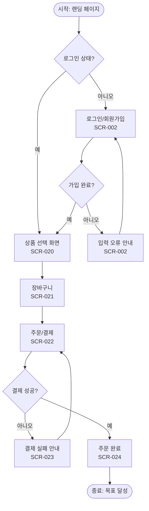

# 유저 플로우 템플릿 (User Flow)

> **용도**: 사용자가 목표를 달성하기까지 거치는 화면·행동·분기·예외를 시각화하고 정의하는 설계 문서. 화면 설계·개발·QA의 공통 기준이 된다.
> **사용 에이전트**: UX Researcher(주), Service Planner, Interaction Designer.
> **선행/연계 산출물**: [`IA_Sitemap.md`](IA_Sitemap.md), [`Screen_List.md`](Screen_List.md).
> **관련 GoldWiki**: [12 유저 플로우](../GoldWiki/12_USER_FLOW.md) · [13 유저 여정](../GoldWiki/13_USER_JOURNEY.md)

### 작성 팁
- **목표 단위로 그린다**: 한 플로우 = 하나의 사용자 목표(예: "회원가입 완료").
- **분기와 예외를 빠짐없이**: 정상 경로(Happy Path)뿐 아니라 오류·이탈·취소 경로를 표시한다.
- **화면ID를 노드에 단다**: 플로우의 각 화면 노드를 화면 목록 ID와 연결한다.
- **결정 노드는 질문형으로**: 분기는 "로그인 상태인가?"처럼 예/아니오로 갈리게 쓴다.

---

## 1. 개요

| 항목 | 내용 |
|------|------|
| 플로우명 | {예: 신규 회원가입 및 첫 결제} |
| 대상 사용자 | {페르소나} |
| 사용자 목표 | {달성하려는 결과} |
| 진입점 | {어디서 시작하는가} |
| 성공 기준 | {완료로 간주하는 상태} |
| 작성자 | {이름} |
| 작성일 | {YYYY-MM-DD} |

---

## 2. 플로우 다이어그램 (mermaid 예시)

> 결정 노드는 `{ }`, 화면 노드는 `[ ]`, 시작/종료는 `( )`로 표기한다. 각 화면 노드에 ` SCR-NNN`으로 화면ID를 병기한다.

---

## 3. 단계별 정의 표

| 단계 | 화면(화면ID) | 사용자 행동 | 시스템 반응 | 분기/예외 | 비고 |
|------|---------------|-------------|-------------|-----------|------|
| 1 | 랜딩(SCR-001) | {진입} | {로그인 상태 확인} | 비로그인 → 2 / 로그인 → 4 | |
| 2 | 로그인/가입(SCR-002) | {정보 입력} | {유효성 검증} | 오류 → 재입력 | |
| 3 | 가입 완료 | {} | {계정 생성} | | |
| 4 | 상품 선택(SCR-020) | {상품 담기} | {장바구니 반영} | | |
| 5 | 결제(SCR-022) | {결제 요청} | {PG 연동} | 실패 → 재시도 | |
| 6 | 주문 완료(SCR-024) | {확인} | {확정/알림 발송} | | 목표 달성 |

---

## 4. 예외/오류 처리 정책

| 예외 상황 | 트리거 | 사용자 안내 | 복구 경로 |
|-----------|--------|-------------|-----------|
| 입력 유효성 실패 | {필수값 누락} | {필드별 인라인 오류} | 재입력 |
| 세션 만료 | {타임아웃} | {재로그인 안내} | 로그인으로 |
| 결제 실패 | {PG 오류} | {사유 안내} | 재시도/취소 |
| 네트워크 오류 | {통신 실패} | {재시도 안내} | 재시도 |

---

## 5. 측정 포인트 (분석 이벤트)

| 이벤트명 | 발생 지점 | 의미 | 핵심 지표 연결 |
|----------|-----------|------|-----------------|
| `signup_start` | SCR-002 진입 | 가입 시작 | 가입 전환율 |
| `signup_complete` | 가입 완료 | 가입 성공 | 가입 전환율 |
| `purchase_complete` | SCR-024 | 결제 성공 | 구매 전환율 |

---

## 6. 검토 체크리스트

- [ ] 정상 경로와 예외 경로가 모두 표현됐다
- [ ] 모든 화면 노드에 화면ID가 매핑됐다
- [ ] 모든 결정 노드의 분기가 한쪽도 빠짐없이 정의됐다
- [ ] 이탈/취소 시 복구 경로가 있다
- [ ] 측정 이벤트가 핵심 지표와 연결됐다

---

| 작성자 | {이름} | 검토자 | {이름} | 버전 | v{1.0} | 작성일 | {YYYY-MM-DD} |
|--------|--------|--------|--------|------|--------|--------|---------------|
