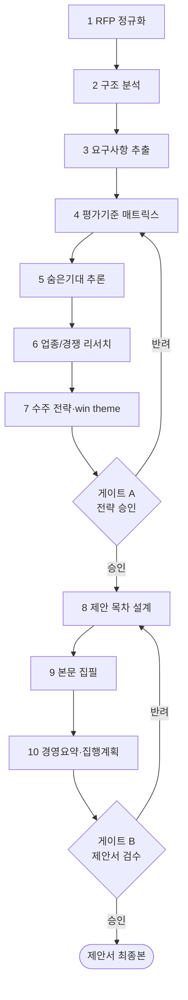

# 워크플로우: RFP 분석 → 제안서 완성 (RFP to Proposal)

## 목적

발주처 RFP 한 건을 입수한 시점부터 **클라이언트에 제출 가능한 제안서 최종본**까지 자율 생산하는 표준 워크플로우다. RFP의 명시 요구·평가기준·숨은 기대를 구조적으로 추출하고, 수주 전략(win theme)을 수립하여 근거 기반 제안서로 완성한다. 모든 단계는 GoldWiki를 먼저 참조(SSOT)하고, 산출 후 GoldWiki를 갱신한다.

관련 GoldWiki: [`../GoldWiki/RFP/RFPAnalysisFramework.md`](../GoldWiki/RFP/RFPAnalysisFramework.md) · [`../GoldWiki/Proposal/README.md`](../GoldWiki/Proposal/README.md) · [`../GoldWiki/Business/README.md`](../GoldWiki/Business/README.md) · 번호형 [`../GoldWiki/04_RFP_ANALYSIS.md`](../GoldWiki/04_RFP_ANALYSIS.md) · [`../GoldWiki/05_PROPOSAL_STRATEGY.md`](../GoldWiki/05_PROPOSAL_STRATEGY.md)

## 시작 조건

- 원본 RFP 문서(PDF/HWP/문서)와 발주처 배경 정보 확보.
- 마감일·예산 상한·제출 형식·평가 방식(정량/정성 배점) 파악.
- [`../GoldWiki/00_START_HERE.md`](../GoldWiki/00_START_HERE.md)와 RFP·Proposal 폴더 README 숙지.
- 프로젝트 식별자(`$PROJECT_ID`)·작업 디렉터리(`$WORKDIR`) 지정, 게이트 승인자 가용성 확인.

## 참여 에이전트

| 에이전트 | 역할 |
| --- | --- |
| `rfp-strategy-lead` | RFP 분석·요구사항·평가기준·숨은기대 추출 총괄 |
| `business-analysis-lead` | 비즈니스 맥락·요구사항 구조화·타당성 분석 |
| `industry-research-lead` | 업종/경쟁/레퍼런스 리서치 |
| `proposal-lead` | 제안 전략·스토리라인·제안서 집필 총괄 |
| `product-strategy-lead` | 솔루션 방향·차별화 가치 정의 |
| `pmo-director` | 일정·리스크·수행 체계(WBS) 검토 |
| `documentation-lead` | GoldWiki 갱신 강제·지식 정합성 |
| `executive-director` | 게이트 최종 승인 |

## 단계별 프로세스

| 단계 | 담당(R) | 입력 | 처리 | 출력 | 게이트 |
| --- | --- | --- | --- | --- | --- |
| 1 RFP 정규화 | rfp-strategy-lead | 원본 RFP | 텍스트 정규화·메타데이터(발주처·예산·기한) 추출 | 정규화 RFP | — |
| 2 구조 분석 | rfp-strategy-lead, business-analysis-lead | 정규화 RFP | 범위·목표·제약·이해관계자 구조화 | 구조 분석서 | — |
| 3 요구사항 추출 | business-analysis-lead | 구조 분석서 | ID·유형·우선순위·출처별 요구사항 정리 | 요구사항 명세(JSON) | — |
| 4 평가기준 매트릭스 | rfp-strategy-lead | RFP 평가표 | 배점·항목별 우리 강점 매핑 | 평가 매트릭스 | — |
| 5 숨은기대 추론 | rfp-strategy-lead | 분석서·매트릭스 | CoT로 미명시 동기·정치적 맥락 추론 | 숨은기대 분석 | — |
| 6 업종/경쟁 리서치 | industry-research-lead | 발주처·업종 | 경쟁사·레퍼런스·표준 벤치마크 | 리서치 노트 | — |
| 7 수주 전략 | proposal-lead, product-strategy-lead | 4·5·6 산출 | win theme·핵심 메시지·차별화 수립 | 제안 전략서 | **A** |
| 8 제안 목차 | proposal-lead | 전략서 | RFP 평가축 정렬 목차·스토리라인 | 제안 목차 | — |
| 9 본문 집필 | proposal-lead, product-strategy-lead, pmo-director | 목차·전략 | 섹션별 본문·솔루션·일정·수행체계 작성 | 제안서 본문 | — |
| 10 경영요약 | proposal-lead, executive-director | 본문 | 1~2p 경영 요약·집행 요약 | 제안서 최종본 | **B** |

## 입력 산출물

- 원본 RFP 문서, 발주처 배경 자료, 과거 유사 프로젝트 메모리([`../GoldWiki/ProjectMemory/README.md`](../GoldWiki/ProjectMemory/README.md)).

## 중간 산출물

- 정규화 RFP, 구조 분석서, 요구사항 명세(JSON), 평가 매트릭스, 숨은기대 분석, 리서치 노트, 제안 전략서, 제안 목차.

## 최종 산출물

- **제안서 최종본**(본문 + 경영 요약 + 집행 계획), 제출 체크리스트 통과본.
- 갱신: [`../GoldWiki/DecisionLog/README.md`](../GoldWiki/DecisionLog/README.md), [`../GoldWiki/ProjectMemory/README.md`](../GoldWiki/ProjectMemory/README.md), [`../GoldWiki/37_BEST_PRACTICES.md`](../GoldWiki/37_BEST_PRACTICES.md).

## 품질 게이트

| 게이트 | 위치 | 통과 조건 | 승인자 | 롤백 |
| --- | --- | --- | --- | --- |
| A 전략 승인 | 7단계 후 | win theme의 평가기준 정렬·수주 가능성 | proposal-lead + executive-director | 4~7 |
| B 제안서 검수 | 10단계 후 | RFP 요구 100% 응답·근거 기반·경영진 수준 품질 | executive-director | 8~10 |

- 게이트 통과 기준 상세: [`../GoldWiki/QA/QualityReviewChecklist.md`](../GoldWiki/QA/QualityReviewChecklist.md), [`../GoldWiki/29_QUALITY_CHECKLIST.md`](../GoldWiki/29_QUALITY_CHECKLIST.md).
- 품질 체크: 요구사항 누락 0건, 평가축 전 항목 응답, 수치·근거 출처 명시, 일관 용어.

## 실패 시 복구 절차

1. **요구 누락 발견:** 3단계 요구사항 명세로 롤백, 누락 ID 추가 후 4~10 재실행. 누락 사유는 [`../GoldWiki/39_COMMON_ERRORS.md`](../GoldWiki/39_COMMON_ERRORS.md)에 기록.
2. **게이트 A 반려:** 평가 매트릭스(4)부터 재검토, 강점 매핑·win theme 재정의.
3. **게이트 B 반려:** 반려 코멘트를 목차(8) 매핑 → 해당 섹션만 재집필. 2회 연속 반려 시 `executive-director` 직접 리뷰 세션 소집.
4. **마감 임박 리스크:** `pmo-director`가 범위 축소(MoSCoW) 결정, DecisionLog 기록 후 핵심 섹션 우선 완성.
5. 모든 롤백은 동일 작업 단위에서 DecisionLog·ProjectMemory를 갱신해 재발을 방지한다.

## RACI 요약

| 구간 | R (실무) | A (승인) | C (자문) | I (통보) |
| --- | --- | --- | --- | --- |
| 1~3 RFP 흡수 | rfp-strategy-lead | proposal-lead | business-analysis-lead | 전 팀 |
| 4~6 분석·추론 | rfp-strategy-lead, business-analysis-lead | proposal-lead | industry-research-lead | UX/디자인 |
| 7 전략(게이트 A) | proposal-lead | executive-director | product-strategy-lead | 전 팀 |
| 8~10 집필(게이트 B) | proposal-lead, product-strategy-lead | executive-director | pmo-director | 클라이언트 |

## 입출력 개요

| 단계군 | 핵심 입력 | 핵심 산출물 |
| --- | --- | --- |
| 1~3 | 원본 RFP | 정규화 RFP·구조 분석·요구 명세 |
| 4~7 | 요구 명세 | 평가 매트릭스·숨은기대·리서치·전략서 |
| 8~10 | 전략서 | 목차·본문·제안서 최종본 |

## 거버넌스

본 워크플로우 실행 중 모든 비자명한 의사결정은 동일 작업 단위에서 [`../GoldWiki/DecisionLog/README.md`](../GoldWiki/DecisionLog/README.md), [`../GoldWiki/ProjectMemory/README.md`](../GoldWiki/ProjectMemory/README.md), [`../GoldWiki/37_BEST_PRACTICES.md`](../GoldWiki/37_BEST_PRACTICES.md), [`../GoldWiki/36_REFERENCE_LIBRARY.md`](../GoldWiki/36_REFERENCE_LIBRARY.md)를 갱신한다. GoldWiki가 단일 진실 공급원(SSOT)이며, 모든 에이전트는 작업 착수 전 관련 GoldWiki 문서를 먼저 참조한다. 후속 워크플로우: [`02_RFP_to_UX.md`](02_RFP_to_UX.md), [`05_Proposal_to_ExecutiveReport.md`](05_Proposal_to_ExecutiveReport.md), [`07_Client_Simulation.md`](07_Client_Simulation.md).
