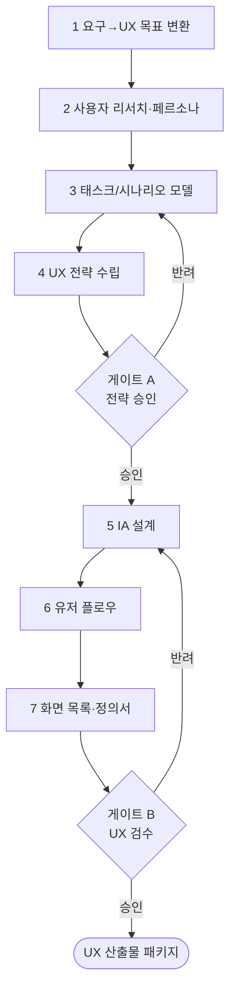

# 워크플로우: RFP → UX 전략·IA·유저플로우·화면목록 (RFP to UX)

## 목적

RFP의 요구사항과 비즈니스 목표를 입력받아 **UX 전략 → 정보구조(IA) → 사용자 플로우 → 화면 목록(화면 정의서)**까지 일관된 UX 설계 산출물을 생산한다. 이후 UI 단계([`03_UX_to_UI.md`](03_UX_to_UI.md))로 인계되는 토대를 만든다. 모든 결정은 사용자 근거(리서치·태스크 모델)에 기반하며 GoldWiki를 SSOT로 참조한다.

관련 GoldWiki: [`../GoldWiki/UX/UXStrategyFramework.md`](../GoldWiki/UX/UXStrategyFramework.md) · [`../GoldWiki/UX/InformationArchitectureGuide.md`](../GoldWiki/UX/InformationArchitectureGuide.md) · 번호형 [`../GoldWiki/07_UX_PRINCIPLES.md`](../GoldWiki/07_UX_PRINCIPLES.md) · [`../GoldWiki/11_INFORMATION_ARCHITECTURE.md`](../GoldWiki/11_INFORMATION_ARCHITECTURE.md) · [`../GoldWiki/12_USER_FLOW.md`](../GoldWiki/12_USER_FLOW.md) · [`../GoldWiki/13_USER_JOURNEY.md`](../GoldWiki/13_USER_JOURNEY.md)

## 시작 조건

- RFP 요구사항 명세(또는 [`01_RFP_to_Proposal.md`](01_RFP_to_Proposal.md) 3단계 산출물) 확보.
- 대상 사용자·비즈니스 목표·핵심 전환 지표(KPI) 확인.
- 기존 IA·플로우 자산 재사용 가능 여부 확인(중복 금지).

## 참여 에이전트

| 에이전트 | 역할 |
| --- | --- |
| `ux-research-lead` | 사용자 리서치·페르소나·태스크 모델·UX 전략 총괄 |
| `information-architecture-lead` | 사이트맵·내비게이션·라벨링·콘텐츠 구조 |
| `service-planning-lead` | 서비스 시나리오·유저 플로우·화면 정의 |
| `product-strategy-lead` | 비즈니스 목표-UX 정렬·우선순위 |
| `ui-design-lead` | 화면 목록 검토(다음 단계 수용성) |
| `documentation-lead` | GoldWiki 갱신·지식 정합성 |

## 단계별 프로세스

1. **요구→UX 목표 변환** — R: `ux-research-lead` / 입력: 요구사항 명세 / 처리: 기능 요구를 사용자 목표·UX 성공지표로 변환 / 출력: UX 목표 정의서.
2. **사용자 리서치·페르소나** — R: `ux-research-lead` / 입력: 사용자 데이터·업종 리서치 / 처리: 페르소나·니즈·맥락 정리 / 출력: 페르소나 카드, 리서치 요약.
3. **태스크/시나리오 모델** — R: `ux-research-lead`, `service-planning-lead` / 입력: 페르소나 / 처리: 핵심 태스크·시나리오·여정 단계화 / 출력: 태스크 모델, 사용자 여정 맵.
4. **UX 전략 수립** — R: `ux-research-lead`, `product-strategy-lead` / 입력: 2·3 산출 / 처리: UX 원칙·핵심 경험·차별화 정의 / 출력: **UX 전략서** / 게이트 **A**.
5. **IA 설계** — R: `information-architecture-lead` / 입력: UX 전략·콘텐츠 인벤토리 / 처리: 사이트맵·내비게이션·라벨링·분류 / 출력: IA 사이트맵, 라벨링 체계.
6. **유저 플로우** — R: `service-planning-lead` / 입력: IA·태스크 모델 / 처리: 진입~전환 플로우·분기·예외 정의 / 출력: 유저 플로우 다이어그램.
7. **화면 목록·정의서** — R: `service-planning-lead`, `ui-design-lead` / 입력: IA·플로우 / 처리: 화면 단위 분해·목적·구성요소·상태 정의 / 출력: **화면 목록 + 화면 정의서** / 게이트 **B**.

## 입력 산출물

- RFP 요구사항 명세(JSON), 비즈니스 목표·KPI, 업종 리서치([`../GoldWiki/Industry/README.md`](../GoldWiki/Industry/README.md)), 기존 IA 자산.

## 중간 산출물

- UX 목표 정의서, 페르소나 카드, 태스크 모델, 사용자 여정 맵, UX 전략서, IA 사이트맵, 유저 플로우 다이어그램.

## 최종 산출물

- **UX 산출물 패키지:** UX 전략서 + IA 사이트맵 + 유저 플로우 + 화면 목록/정의서.
- 갱신: [`../GoldWiki/UX/UXStrategyFramework.md`](../GoldWiki/UX/UXStrategyFramework.md), [`../GoldWiki/DecisionLog/README.md`](../GoldWiki/DecisionLog/README.md), [`../GoldWiki/ProjectMemory/README.md`](../GoldWiki/ProjectMemory/README.md).

## 품질 게이트

| 게이트 | 위치 | 통과 조건 | 승인자 | 롤백 |
| --- | --- | --- | --- | --- |
| A UX 전략 | 4단계 후 | 비즈니스 목표-UX 정렬, 사용자 근거 충분 | ux-research-lead | 3~4 |
| B UX 검수 | 7단계 후 | 요구사항 전부 화면에 매핑, 플로우 단절·고립 화면 0건, 접근성 고려 | ux-research-lead + ui-design-lead | 5~7 |

- 체크리스트: [`../GoldWiki/QA/QualityReviewChecklist.md`](../GoldWiki/QA/QualityReviewChecklist.md), [`../GoldWiki/16_ACCESSIBILITY.md`](../GoldWiki/16_ACCESSIBILITY.md).
- 추가 검증: 모든 요구사항 ID가 최소 1개 화면에 연결(추적성 매트릭스), 모든 화면이 플로우에 도달 가능.

## 실패 시 복구 절차

1. **고립 화면/단절 플로우:** 6단계로 롤백, 진입·이탈 경로 재정의 후 7단계 재실행.
2. **요구 미매핑:** 추적성 매트릭스에서 미매핑 ID 식별 → 화면 추가 또는 요구 재해석, DecisionLog 기록.
3. **게이트 A 반려:** 태스크 모델(3) 부족 시 추가 리서치, UX 전략 재수립.
4. **IA 라벨 혼선:** 카드소팅/트리테스트 근거 부재 시 5단계 재작업, 사용자 검증 결과 첨부.
5. 반복 실패 패턴은 [`../GoldWiki/39_COMMON_ERRORS.md`](../GoldWiki/39_COMMON_ERRORS.md)에 누적 기록한다.

## RACI 요약

| 구간 | R (실무) | A (승인) | C (자문) | I (통보) |
| --- | --- | --- | --- | --- |
| 1~3 리서치 | ux-research-lead | ux-research-lead | service-planning-lead | 제품/디자인 |
| 4 전략(게이트 A) | ux-research-lead | ux-research-lead | product-strategy-lead | 전 팀 |
| 5~6 IA·플로우 | information-architecture-lead, service-planning-lead | ux-research-lead | ui-design-lead | 엔지니어링 |
| 7 화면(게이트 B) | service-planning-lead | ux-research-lead + ui-design-lead | information-architecture-lead | 디자인 |

## 입출력 개요

| 단계군 | 핵심 입력 | 핵심 산출물 |
| --- | --- | --- |
| 1~4 | 요구 명세·사용자 데이터 | 페르소나·태스크 모델·UX 전략서 |
| 5~6 | UX 전략 | IA 사이트맵·유저 플로우 |
| 7 | IA·플로우 | 화면 목록·화면 정의서 |

## 거버넌스

추적성 매트릭스(요구 ID↔화면)는 다음 단계의 핵심 인계물이다. 모든 UX 결정은 [`../GoldWiki/UX/UXStrategyFramework.md`](../GoldWiki/UX/UXStrategyFramework.md)와 [`../GoldWiki/DecisionLog/README.md`](../GoldWiki/DecisionLog/README.md)에 반영하며, 재사용 가능한 IA/플로우 패턴은 [`../GoldWiki/37_BEST_PRACTICES.md`](../GoldWiki/37_BEST_PRACTICES.md)에 자산화한다. GoldWiki를 먼저 참조한다(SSOT). 후속 워크플로우: [`03_UX_to_UI.md`](03_UX_to_UI.md).
