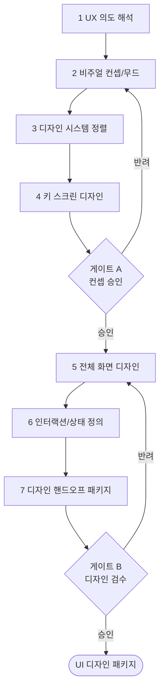

# 워크플로우: UX → UI 컨셉·디자인 (UX to UI)

## 목적

확정된 UX 산출물(전략·IA·플로우·화면 목록)을 입력받아 **UI 비주얼 컨셉 → 디자인 시스템 정렬 → 키 스크린 디자인 → 전체 화면 디자인**까지 완성한다. 브랜드 경험(BX)과 디자인 시스템(토큰·컴포넌트)을 재사용하여 일관성·접근성·구현 가능성을 보장한다. 다음 단계 퍼블리싱([`04_UI_to_Publishing.md`](04_UI_to_Publishing.md))으로 인계한다.

관련 GoldWiki: [`../GoldWiki/UI/README.md`](../GoldWiki/UI/README.md) · [`../GoldWiki/DesignSystem/README.md`](../GoldWiki/DesignSystem/README.md) · [`../GoldWiki/Brand/README.md`](../GoldWiki/Brand/README.md) · 번호형 [`../GoldWiki/08_UI_GUIDELINES.md`](../GoldWiki/08_UI_GUIDELINES.md) · [`../GoldWiki/09_DESIGN_SYSTEM.md`](../GoldWiki/09_DESIGN_SYSTEM.md) · [`../GoldWiki/14_COMPONENT_LIBRARY.md`](../GoldWiki/14_COMPONENT_LIBRARY.md) · [`../GoldWiki/15_DESIGN_TOKEN.md`](../GoldWiki/15_DESIGN_TOKEN.md)

## 시작 조건

- [`02_RFP_to_UX.md`](02_RFP_to_UX.md)의 UX 산출물 패키지(게이트 B 통과본) 확보.
- 브랜드 가이드·기존 디자인 토큰/컴포넌트 라이브러리 위치 확인(재사용 우선, 중복 금지).
- 대상 디바이스·반응형 브레이크포인트·접근성 목표(WCAG 2.2 AA) 확정.

## 참여 에이전트

| 에이전트 | 역할 |
| --- | --- |
| `ui-design-lead` | UI 비주얼 컨셉·키 스크린·전체 화면 디자인 총괄 |
| `design-system-lead` | 토큰·컴포넌트·패턴 정의 및 재사용 거버넌스 |
| `bx-design-lead` | 브랜드 경험·톤·비주얼 아이덴티티 정렬 |
| `ux-research-lead` | UX 의도 보존 검증·사용성 리뷰 |
| `publishing-lead` | 구현 가능성·반응형/접근성 사전 검토 |
| `documentation-lead` | 디자인 결정 GoldWiki 갱신 |

## 단계별 프로세스

1. **UX 의도 해석** — R: `ui-design-lead`, `ux-research-lead` / 입력: 화면 정의서·플로우 / 출력: 화면별 디자인 목표·우선순위.
2. **비주얼 컨셉/무드** — R: `ui-design-lead`, `bx-design-lead` / 입력: 브랜드 가이드 / 출력: 무드보드·비주얼 컨셉 시안(2~3안).
3. **디자인 시스템 정렬** — R: `design-system-lead` / 입력: 컨셉·기존 토큰 / 처리: 컬러·타이포·스페이싱·컴포넌트 매핑, 신규 토큰 최소화 / 출력: 토큰·컴포넌트 매핑표.
4. **키 스크린 디자인** — R: `ui-design-lead` / 입력: 컨셉·토큰 / 출력: 핵심 화면 3~5종 고완성도 디자인 / 게이트 **A**.
5. **전체 화면 디자인** — R: `ui-design-lead` / 입력: 키 스크린 / 출력: 전 화면 디자인(반응형 변형 포함).
6. **인터랙션/상태 정의** — R: `ui-design-lead`, `design-system-lead` / 출력: 상태(hover/focus/disabled/error)·전환·마이크로인터랙션 명세.
7. **디자인 핸드오프 패키지** — R: `ui-design-lead`, `publishing-lead` / 출력: 스펙·에셋·토큰·컴포넌트 문서 / 게이트 **B**.

## 입력 산출물

- UX 산출물 패키지(전략·IA·플로우·화면 정의서), 브랜드 가이드, 기존 디자인 토큰/컴포넌트 라이브러리.

## 중간 산출물

- 화면별 디자인 목표, 무드보드/컨셉 시안, 토큰·컴포넌트 매핑표, 키 스크린, 상태/인터랙션 명세.

## 최종 산출물

- **UI 디자인 패키지:** 전체 화면 디자인 + 디자인 시스템 매핑 + 인터랙션 명세 + 핸드오프 스펙·에셋.
- 갱신: [`../GoldWiki/DesignSystem/README.md`](../GoldWiki/DesignSystem/README.md), [`../GoldWiki/UI/README.md`](../GoldWiki/UI/README.md), [`../GoldWiki/DecisionLog/README.md`](../GoldWiki/DecisionLog/README.md).

## 품질 게이트

| 게이트 | 위치 | 통과 조건 | 승인자 | 롤백 |
| --- | --- | --- | --- | --- |
| A 컨셉 승인 | 4단계 후 | 브랜드 정합성·UX 의도 보존·차별화 | ui-design-lead + bx-design-lead | 2~4 |
| B 디자인 검수 | 7단계 후 | 디자인 시스템 일관성, WCAG 2.2 AA 대비/포커스, 구현 가능성 | ui-design-lead + publishing-lead | 5~7 |

- 체크: 색 대비 ≥ AA, 토큰 외 하드코딩 0건, 컴포넌트 재사용율 목표 충족, 모든 상태 정의 완비. 기준: [`../GoldWiki/QA/QualityReviewChecklist.md`](../GoldWiki/QA/QualityReviewChecklist.md), [`../GoldWiki/16_ACCESSIBILITY.md`](../GoldWiki/16_ACCESSIBILITY.md).

## 실패 시 복구 절차

1. **디자인 시스템 이탈(하드코딩/중복 토큰):** 3단계로 롤백, `design-system-lead`가 토큰으로 치환 후 5~7 재실행.
2. **접근성 미달(대비/포커스):** 해당 화면만 6단계 재작업, 대비비 재검증 후 게이트 B 재상정.
3. **게이트 A 반려:** 무드/컨셉(2)부터 재탐색, 브랜드 정렬 근거 첨부.
4. **구현 불가 요소:** `publishing-lead` 피드백 반영해 대체 패턴 적용, DecisionLog 기록.
5. 반복 원인은 [`../GoldWiki/39_COMMON_ERRORS.md`](../GoldWiki/39_COMMON_ERRORS.md)에 기록한다.

## RACI 요약

| 구간 | R (실무) | A (승인) | C (자문) | I (통보) |
| --- | --- | --- | --- | --- |
| 1~2 컨셉 | ui-design-lead | ui-design-lead | bx-design-lead | UX |
| 3 시스템 정렬 | design-system-lead | design-system-lead | ui-design-lead | 퍼블리싱 |
| 4 키 스크린(게이트 A) | ui-design-lead | ui-design-lead + bx-design-lead | ux-research-lead | 전 팀 |
| 5~7 전체·핸드오프(게이트 B) | ui-design-lead | ui-design-lead + publishing-lead | design-system-lead | 엔지니어링 |

## 입출력 개요

| 단계군 | 핵심 입력 | 핵심 산출물 |
| --- | --- | --- |
| 1~4 | UX 패키지·브랜드 | 컨셉 시안·토큰 매핑·키 스크린 |
| 5~6 | 키 스크린 | 전체 화면·상태/인터랙션 명세 |
| 7 | 전체 디자인 | 핸드오프 패키지(스펙·에셋) |

## 거버넌스

신규 토큰/컴포넌트는 `design-system-lead` 승인 없이 생성하지 않으며(중복 금지), 생성 시 [`../GoldWiki/DesignSystem/README.md`](../GoldWiki/DesignSystem/README.md)에 등록한다. 모든 디자인 결정은 [`../GoldWiki/DecisionLog/README.md`](../GoldWiki/DecisionLog/README.md)에 기록하고 GoldWiki를 먼저 참조한다(SSOT). 후속 워크플로우: [`04_UI_to_Publishing.md`](04_UI_to_Publishing.md).
