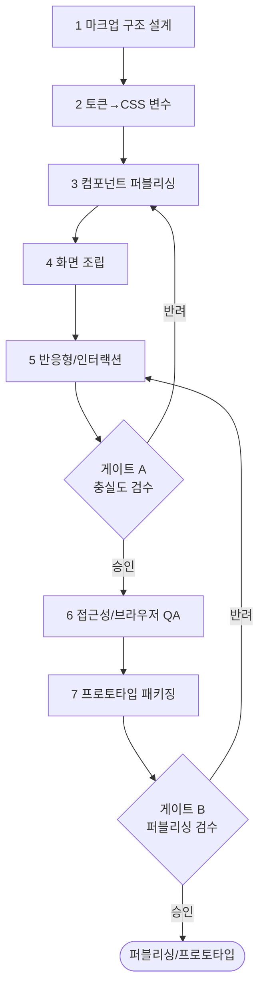

# 워크플로우: UI → HTML 퍼블리싱·프로토타입 (UI to Publishing)

## 목적

확정된 UI 디자인 패키지를 입력받아 **시맨틱 HTML/CSS 퍼블리싱과 동작 가능한 프로토타입**을 생산한다. 디자인 토큰을 CSS 변수로 구현하고, 반응형·접근성·크로스브라우저를 보장하며, 이후 프론트엔드 개발([`../GoldWiki/Frontend/README.md`](../GoldWiki/Frontend/README.md))로 이어질 수 있는 정돈된 마크업을 만든다.

관련 GoldWiki: [`../GoldWiki/Publishing/HTMLCSSGuide.md`](../GoldWiki/Publishing/HTMLCSSGuide.md) · [`../GoldWiki/Frontend/README.md`](../GoldWiki/Frontend/README.md) · [`../GoldWiki/DesignSystem/README.md`](../GoldWiki/DesignSystem/README.md) · 번호형 [`../GoldWiki/17_HTML_GUIDE.md`](../GoldWiki/17_HTML_GUIDE.md) · [`../GoldWiki/18_CSS_GUIDE.md`](../GoldWiki/18_CSS_GUIDE.md) · [`../GoldWiki/19_JS_GUIDE.md`](../GoldWiki/19_JS_GUIDE.md) · [`../GoldWiki/16_ACCESSIBILITY.md`](../GoldWiki/16_ACCESSIBILITY.md)

## 시작 조건

- [`03_UX_to_UI.md`](03_UX_to_UI.md)의 UI 디자인 패키지(게이트 B 통과본)·핸드오프 스펙·에셋 확보.
- 디자인 토큰·컴포넌트 명세 확정, 지원 브라우저/디바이스 매트릭스 합의.
- 프로토타입 범위(정적/인터랙티브)와 호스팅 방식 결정.

## 참여 에이전트

| 에이전트 | 역할 |
| --- | --- |
| `publishing-lead` | 시맨틱 마크업·CSS·반응형·프로토타입 구현 총괄 |
| `frontend-lead` | 컴포넌트화·JS 인터랙션·구조 검토 |
| `design-system-lead` | 토큰→CSS 변수 매핑·컴포넌트 일치 검증 |
| `ui-design-lead` | 디자인 충실도(pixel) 검수 |
| `qa-lead` | 접근성·크로스브라우저·반응형 QA |
| `documentation-lead` | 퍼블리싱 가이드·결정 GoldWiki 갱신 |

## 단계별 프로세스

1. **마크업 구조 설계** — R: `publishing-lead`, `frontend-lead` / 입력: 화면 정의서 / 출력: 시맨틱 HTML 골격·랜드마크·heading 구조.
2. **토큰→CSS 변수** — R: `design-system-lead`, `publishing-lead` / 입력: 디자인 토큰 / 출력: CSS custom properties·유틸리티/베이스 스타일.
3. **컴포넌트 퍼블리싱** — R: `publishing-lead` / 입력: 컴포넌트 명세 / 출력: 재사용 컴포넌트 마크업/스타일 + 상태(hover/focus/error).
4. **화면 조립** — R: `publishing-lead` / 입력: 컴포넌트·디자인 / 출력: 전 화면 정적 페이지.
5. **반응형/인터랙션** — R: `publishing-lead`, `frontend-lead` / 출력: 브레이크포인트 대응 + 필수 JS 인터랙션.
6. **접근성/브라우저 QA** — R: `qa-lead` / 출력: WCAG 점검 결과·크로스브라우저 리포트.
7. **프로토타입 패키징** — R: `publishing-lead` / 출력: 빌드/호스팅 가능한 프로토타입 + 퍼블리싱 가이드 / 게이트 **B**.

## 입력 산출물

- UI 디자인 패키지, 핸드오프 스펙, 디자인 토큰/컴포넌트 명세, 에셋(아이콘/이미지/폰트).

## 중간 산출물

- HTML 골격, CSS 변수 세트, 컴포넌트 라이브러리(퍼블리싱본), 정적 화면, 반응형/인터랙션 구현, QA 리포트.

## 최종 산출물

- **퍼블리싱 패키지:** 시맨틱 HTML/CSS/JS + 동작 프로토타입 + 퍼블리싱 가이드 + QA 리포트.
- 갱신: [`../GoldWiki/Publishing/HTMLCSSGuide.md`](../GoldWiki/Publishing/HTMLCSSGuide.md), [`../GoldWiki/DecisionLog/README.md`](../GoldWiki/DecisionLog/README.md), [`../GoldWiki/37_BEST_PRACTICES.md`](../GoldWiki/37_BEST_PRACTICES.md).

## 품질 게이트

| 게이트 | 위치 | 통과 조건 | 승인자 | 롤백 |
| --- | --- | --- | --- | --- |
| A 충실도 검수 | 5단계 후 | 디자인 충실도, 토큰 사용(하드코딩 0), 반응형 정상 | ui-design-lead + design-system-lead | 3~5 |
| B 퍼블리싱 검수 | 7단계 후 | WCAG 2.2 AA, 지원 브라우저 통과, HTML 유효성·시맨틱 | qa-lead + publishing-lead | 5~7 |

- 체크: HTML 검증 통과, 키보드 내비게이션·포커스 가시성, alt/aria 적정, Lighthouse 접근성 점수 목표. 기준: [`../GoldWiki/QA/QualityReviewChecklist.md`](../GoldWiki/QA/QualityReviewChecklist.md).

## 실패 시 복구 절차

1. **하드코딩 값 발견:** 2단계로 롤백, CSS 변수로 치환 후 3~5 재실행.
2. **접근성 실패:** 6단계 결과의 위반 항목별로 컴포넌트(3) 또는 화면(4) 수정, 재QA.
3. **브라우저 깨짐:** 영향 범위 식별 → 5단계 반응형/폴백 수정, 크로스브라우저 재검증.
4. **게이트 A 반려(충실도):** 디자인 패키지와 diff 비교 후 컴포넌트/화면 재작업.
5. 재발 패턴은 [`../GoldWiki/39_COMMON_ERRORS.md`](../GoldWiki/39_COMMON_ERRORS.md)에 기록한다.

## RACI 요약

| 구간 | R (실무) | A (승인) | C (자문) | I (통보) |
| --- | --- | --- | --- | --- |
| 1~2 구조·토큰 | publishing-lead | publishing-lead | design-system-lead | 프론트 |
| 3~5 구현(게이트 A) | publishing-lead, frontend-lead | ui-design-lead + design-system-lead | frontend-lead | QA |
| 6 QA | qa-lead | qa-lead | publishing-lead | 디자인 |
| 7 패키징(게이트 B) | publishing-lead | qa-lead + publishing-lead | frontend-lead | 전 팀 |

## 입출력 개요

| 단계군 | 핵심 입력 | 핵심 산출물 |
| --- | --- | --- |
| 1~2 | 디자인 패키지·토큰 | HTML 골격·CSS 변수 |
| 3~5 | 컴포넌트 명세 | 컴포넌트·화면·반응형/인터랙션 |
| 6~7 | 구현 결과 | QA 리포트·프로토타입 패키지 |

## 거버넌스

토큰은 단일 출처(디자인 시스템)에서만 가져오며 색·간격·타이포의 하드코딩을 금지한다(게이트 A 차단 사유). 퍼블리싱 컨벤션·재사용 컴포넌트는 [`../GoldWiki/Publishing/HTMLCSSGuide.md`](../GoldWiki/Publishing/HTMLCSSGuide.md)에 반영하고, 결정은 [`../GoldWiki/DecisionLog/README.md`](../GoldWiki/DecisionLog/README.md)에 기록한다. GoldWiki를 먼저 참조한다(SSOT). 후속: 프론트엔드 개발([`../GoldWiki/Frontend/README.md`](../GoldWiki/Frontend/README.md)), 품질 검증([`06_Project_QualityReview.md`](06_Project_QualityReview.md)).
