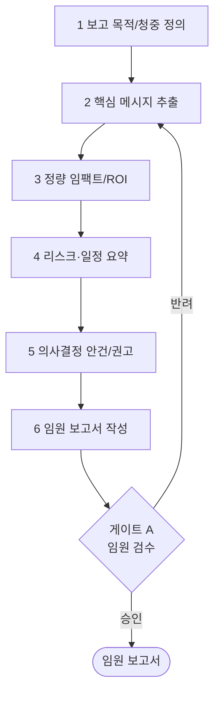

# 워크플로우: 제안 → 임원 보고서 (Proposal to Executive Report)

## 목적

완성된 제안서·프로젝트 산출물을 입력받아 **경영진(임원/CEO·클라이언트 의사결정자)용 보고서**로 압축·재구성한다. 핵심 의사결정 포인트, 비즈니스 임팩트, 투자 대비 효과(ROI), 리스크·일정·승인 요청을 1~3페이지의 밀도 높은 임원 언어로 정리한다.

관련 GoldWiki: [`../GoldWiki/Proposal/README.md`](../GoldWiki/Proposal/README.md) · [`../GoldWiki/Business/README.md`](../GoldWiki/Business/README.md) · [`../GoldWiki/Organization/README.md`](../GoldWiki/Organization/README.md) · 번호형 [`../GoldWiki/05_PROPOSAL_STRATEGY.md`](../GoldWiki/05_PROPOSAL_STRATEGY.md) · [`../GoldWiki/02_BUSINESS_GOALS.md`](../GoldWiki/02_BUSINESS_GOALS.md) · [`../GoldWiki/32_DECISION_LOG.md`](../GoldWiki/32_DECISION_LOG.md)

## 시작 조건

- 제안서 최종본([`01_RFP_to_Proposal.md`](01_RFP_to_Proposal.md) 산출물) 또는 프로젝트 마일스톤 산출물 확보.
- 보고 대상(내부 임원 / 클라이언트 C-level)과 의사결정 안건 정의.
- 예산·일정·리스크·기대효과 수치 출처 확보.

## 참여 에이전트

| 에이전트 | 역할 |
| --- | --- |
| `executive-director` | 보고서 메시지·승인 안건·최종 승인 총괄 |
| `proposal-lead` | 제안 핵심 추출·스토리라인 |
| `business-analysis-lead` | ROI·비용·효과 정량화 |
| `coo-operator` | 실행 가능성·운영 영향 검토 |
| `pmo-director` | 일정·리스크·마일스톤 요약 |
| `documentation-lead` | 보고서 포맷·GoldWiki 갱신 |

## 단계별 프로세스

| 단계 | 담당(R) | 입력 | 처리 | 출력 |
| --- | --- | --- | --- | --- |
| 1 목적/청중 | executive-director | 제안서·안건 | 청중 수준·관심사·결정 범위 정의 | 보고 브리프 |
| 2 핵심 메시지 | proposal-lead | 제안서 | 3대 메시지·핵심 결론 선별 | 메시지 하우스 |
| 3 정량 임팩트 | business-analysis-lead | 비용·효과 자료 | ROI·비용·전환 효과 정량화·출처 명시 | 임팩트 표·차트 |
| 4 리스크·일정 | pmo-director, coo-operator | 리스크 레지스터·WBS | Top 리스크·마일스톤·운영 영향 요약 | 리스크/일정 요약 |
| 5 의사결정 안건 | executive-director | 1~4 산출 | 승인 요청·옵션·권고안 정리 | 의사결정 안건서 |
| 6 보고서 작성 | proposal-lead, documentation-lead | 전 산출 | 1~3p 임원 보고서 집필(요약 우선 구조) | **임원 보고서** |

## 입력 산출물

- 제안서 최종본, 비용/효과 데이터, 리스크 레지스터, WBS/일정, 클라이언트 컨텍스트([`../GoldWiki/34_CLIENT_KNOWLEDGE.md`](../GoldWiki/34_CLIENT_KNOWLEDGE.md)).

## 중간 산출물

- 보고 브리프, 메시지 하우스, 임팩트 표/차트, 리스크·일정 요약, 의사결정 안건서.

## 최종 산출물

- **임원 보고서**(Executive Summary 1p + 본문 1~2p + 의사결정 안건). 발표용 슬라이드 변환 가능 구조.
- 갱신: [`../GoldWiki/DecisionLog/README.md`](../GoldWiki/DecisionLog/README.md), [`../GoldWiki/ProjectMemory/README.md`](../GoldWiki/ProjectMemory/README.md).

## 품질 게이트

| 게이트 | 위치 | 통과 조건 | 승인자 | 롤백 |
| --- | --- | --- | --- | --- |
| A 임원 검수 | 6단계 후 | 의사결정에 충분, 수치 근거 명시, 1~3p 내 압축, 임원 언어 | executive-director | 2~6 |

- 체크: 첫 페이지에서 결론·요청 파악 가능(Top-down), 모든 수치 출처 표기, 전문용어 최소화, 권고안 명확. 기준: [`../GoldWiki/QA/QualityReviewChecklist.md`](../GoldWiki/QA/QualityReviewChecklist.md).

## 실패 시 복구 절차

1. **결론이 묻힘:** 메시지 추출(2)로 롤백, 피라미드 구조로 재배열 후 6단계 재작성.
2. **수치 근거 미흡:** 3단계 재실행, `business-analysis-lead`가 출처·가정 명시.
3. **분량 초과:** 부록 분리·세부 제거로 본문 압축, 핵심 안건만 유지.
4. **게이트 A 반려:** 반려 사유를 안건서(5)에 반영, `executive-director`와 직접 정렬 세션.
5. 반려 사유는 [`../GoldWiki/39_COMMON_ERRORS.md`](../GoldWiki/39_COMMON_ERRORS.md)에 기록한다.

## RACI 요약

| 구간 | R (실무) | A (승인) | C (자문) | I (통보) |
| --- | --- | --- | --- | --- |
| 1 브리프 | executive-director | executive-director | proposal-lead | 보고 대상 |
| 2 메시지 | proposal-lead | executive-director | business-analysis-lead | — |
| 3~4 임팩트·리스크 | business-analysis-lead, pmo-director | executive-director | coo-operator | — |
| 5~6 안건·작성(게이트 A) | proposal-lead, documentation-lead | executive-director | coo-operator | 보고 대상 |

## 입출력 개요

| 단계군 | 핵심 입력 | 핵심 산출물 |
| --- | --- | --- |
| 1~2 | 제안서·안건 | 보고 브리프·메시지 하우스 |
| 3~4 | 비용/리스크 자료 | 임팩트 표·리스크/일정 요약 |
| 5~6 | 종합 산출 | 의사결정 안건서·임원 보고서 |

## 거버넌스

보고서는 피라미드(결론 우선) 구조를 따르고 모든 수치에 출처·가정을 명기한다. 의사결정 안건과 승인 결과는 [`../GoldWiki/DecisionLog/README.md`](../GoldWiki/DecisionLog/README.md)에, 재사용 가능한 보고 포맷은 [`../GoldWiki/Templates/README.md`](../GoldWiki/Templates/README.md)·[`../GoldWiki/37_BEST_PRACTICES.md`](../GoldWiki/37_BEST_PRACTICES.md)에 자산화한다. GoldWiki를 먼저 참조한다(SSOT).

## 보고서 표준 구조 (1~3p)

| 영역 | 내용 | 분량 |
| --- | --- | --- |
| Executive Summary | 결론·핵심 권고·승인 요청 | 1p |
| 비즈니스 임팩트 | ROI·비용·기대효과(표/차트) | 0.5~1p |
| 리스크·일정 | Top 리스크·완화·마일스톤 | 0.5p |
| 의사결정 안건 | 옵션·권고·필요 자원 | 0.5p |

> 첫 페이지만 읽어도 의사결정이 가능해야 한다. 세부 근거·산식은 부록으로 분리한다.
