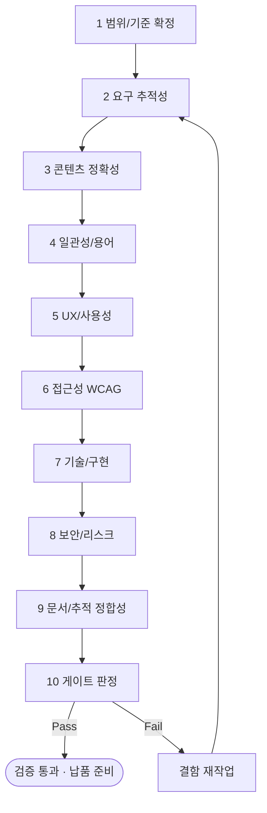

# 워크플로우: 프로젝트 품질 검증 (Project Quality Review · 10단계 체계)

## 목적

프로젝트 산출물 전체를 **10단계 품질 검증 체계**로 점검하여 클라이언트 제출/납품 가능 수준을 보증한다. 요구 충족성·일관성·접근성·보안·구현 가능성·문서 정합성을 다단계로 검증하고, 결함을 등급화하여 게이트 통과 여부를 결정한다. [`../GoldWiki/QA/QualityReviewChecklist.md`](../GoldWiki/QA/QualityReviewChecklist.md)를 정본 체크리스트로 사용한다.

관련 GoldWiki: [`../GoldWiki/QA/QualityReviewChecklist.md`](../GoldWiki/QA/QualityReviewChecklist.md) · [`../GoldWiki/QA/README.md`](../GoldWiki/QA/README.md) · 번호형 [`../GoldWiki/29_QUALITY_CHECKLIST.md`](../GoldWiki/29_QUALITY_CHECKLIST.md) · [`../GoldWiki/30_TEST_STRATEGY.md`](../GoldWiki/30_TEST_STRATEGY.md) · [`../GoldWiki/24_SECURITY_GUIDE.md`](../GoldWiki/24_SECURITY_GUIDE.md) · [`../GoldWiki/16_ACCESSIBILITY.md`](../GoldWiki/16_ACCESSIBILITY.md)

## 시작 조건

- 검증 대상 산출물(제안서/UX/UI/퍼블리싱/개발 산출물 등) 버전 고정(freeze).
- 검증 범위·기준선(DoD)·심각도 기준 합의.
- [`../GoldWiki/QA/QualityReviewChecklist.md`](../GoldWiki/QA/QualityReviewChecklist.md) 최신본 확인.

## 참여 에이전트

| 에이전트 | 역할 |
| --- | --- |
| `qa-lead` | 품질 검증 총괄·결함 등급화·게이트 판정 |
| `security-risk-lead` | 보안·개인정보·리스크 검증 |
| `cto-reviewer` | 아키텍처·구현 가능성·기술 부채 검토 |
| `ux-research-lead` | UX/사용성·접근성 검증 |
| `documentation-lead` | 문서 정합성·GoldWiki 추적성 |
| `pmo-director` | 일정·범위 영향·재작업 조율 |
| `executive-director` | 최종 품질 게이트 승인 |

## 단계별 프로세스 (10단계)

| # | 단계 | 담당(R) | 검증 내용 | 산출 |
| --- | --- | --- | --- | --- |
| 1 | 범위/기준 확정 | qa-lead | 검증 대상·DoD·심각도 정의 | 검증 계획 |
| 2 | 요구 추적성 | qa-lead | 요구 ID↔산출물 매핑·누락 | 추적성 매트릭스 |
| 3 | 콘텐츠 정확성 | qa-lead, documentation-lead | 사실·수치·근거 출처 | 정확성 리포트 |
| 4 | 일관성/용어 | documentation-lead | 용어·포맷·스타일 통일 | 일관성 리포트 |
| 5 | UX/사용성 | ux-research-lead | 플로우·정보구조·휴리스틱 | 사용성 결함 목록 |
| 6 | 접근성 WCAG | ux-research-lead, qa-lead | WCAG 2.2 AA 점검 | 접근성 리포트 |
| 7 | 기술/구현 | cto-reviewer | 아키텍처·코드·API·성능 | 기술 리뷰 |
| 8 | 보안/리스크 | security-risk-lead | OWASP·개인정보·리스크 | 보안 리포트 |
| 9 | 문서/추적 정합성 | documentation-lead | GoldWiki 갱신·링크·SSOT 정합 | 정합성 리포트 |
| 10 | 게이트 판정 | qa-lead, executive-director | 결함 집계·등급·통과 판정 | **품질 판정서** |

## 입력 산출물

- 검증 대상 산출물 버전, 요구사항 명세, DoD/체크리스트, 이전 검증 이력([`../GoldWiki/ProjectMemory/README.md`](../GoldWiki/ProjectMemory/README.md)).

## 중간 산출물

- 검증 계획, 추적성 매트릭스, 정확성/일관성/사용성/접근성/기술/보안/정합성 리포트, 결함 등록부(severity 분류).

## 최종 산출물

- **품질 판정서**(Pass/Conditional/Fail + 결함 목록 + 재작업 지시).
- 갱신: [`../GoldWiki/DecisionLog/README.md`](../GoldWiki/DecisionLog/README.md), [`../GoldWiki/39_COMMON_ERRORS.md`](../GoldWiki/39_COMMON_ERRORS.md), [`../GoldWiki/37_BEST_PRACTICES.md`](../GoldWiki/37_BEST_PRACTICES.md).

## 품질 게이트

| 게이트 | 위치 | 통과 조건 | 승인자 |
| --- | --- | --- | --- |
| 최종 품질 | 10단계 | Critical/Major 결함 0, Minor 합의 한도 이내, 전 단계 리포트 Pass | qa-lead + executive-director |

- 심각도: **Critical**(요구 미충족/보안취약/접근성 차단) = 즉시 차단, **Major**(중대 결함) = 통과 불가, **Minor**(개선) = 한도 내 허용.
- 정본 기준: [`../GoldWiki/QA/QualityReviewChecklist.md`](../GoldWiki/QA/QualityReviewChecklist.md), [`../GoldWiki/29_QUALITY_CHECKLIST.md`](../GoldWiki/29_QUALITY_CHECKLIST.md).

## 실패 시 복구 절차

1. **Critical/Major 발견:** 결함을 담당 워크플로우(01~05)로 라우팅, 수정 후 2단계부터 재검증(영향 단계만 선택 재실행 가능).
2. **추적성 누락:** 2단계로 회귀, 누락 요구를 산출물에 반영하고 매트릭스 갱신.
3. **반복 동일 결함:** [`../GoldWiki/39_COMMON_ERRORS.md`](../GoldWiki/39_COMMON_ERRORS.md)에 패턴 등록, 체크리스트에 항목 추가(예방).
4. **게이트 교착(2회 연속 Fail):** `pmo-director`가 범위/일정 재협의, `executive-director` 조정 회의.
5. 모든 판정·재작업은 DecisionLog에 기록하여 감사 추적성을 확보한다.

## RACI 요약

| 구간 | R (실무) | A (승인) | C (자문) | I (통보) |
| --- | --- | --- | --- | --- |
| 1~4 정확성·일관성 | qa-lead, documentation-lead | qa-lead | — | 산출물 담당 |
| 5~6 UX·접근성 | ux-research-lead | qa-lead | qa-lead | 디자인 |
| 7~8 기술·보안 | cto-reviewer, security-risk-lead | qa-lead | pmo-director | 엔지니어링 |
| 9~10 정합·판정 | documentation-lead, qa-lead | executive-director | pmo-director | 전 팀 |

## 입출력 개요

| 단계군 | 핵심 입력 | 핵심 산출물 |
| --- | --- | --- |
| 1~4 | 산출물·요구 명세 | 검증 계획·추적성·정확성/일관성 리포트 |
| 5~8 | 산출물·코드 | 사용성·접근성·기술·보안 리포트 |
| 9~10 | 전 리포트 | 정합성 리포트·품질 판정서 |

## 거버넌스

품질 판정서(Pass/Conditional/Fail)는 납품([`10_Final_Delivery.md`](10_Final_Delivery.md)) 진입의 필수 선행 조건이다. 모든 결함·판정은 [`../GoldWiki/DecisionLog/README.md`](../GoldWiki/DecisionLog/README.md)에 기록하고, 반복 결함은 [`../GoldWiki/QA/QualityReviewChecklist.md`](../GoldWiki/QA/QualityReviewChecklist.md)에 예방 항목으로 추가한다. GoldWiki를 먼저 참조한다(SSOT). 연계: 리스크 라우팅 [`09_PMO_RiskManagement.md`](09_PMO_RiskManagement.md).
