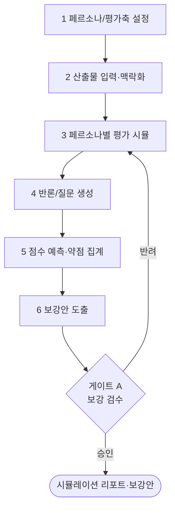

# 워크플로우: 고객 시뮬레이션 (Client Simulation)

## 목적

제안서·디자인·솔루션을 클라이언트에게 제출하기 **전에**, 발주처 의사결정자·평가위원·실사용자 관점을 AI로 모사하여 약점·반론·평가 리스크를 사전 발굴한다. AIClientSimulation(고객 시뮬레이션) 체계를 통해 평가 점수를 예측하고, 제출 전 보강 포인트를 도출한다.

관련 GoldWiki: [`../GoldWiki/Research/README.md`](../GoldWiki/Research/README.md) (AIClientSimulation 정본 위치) · [`../GoldWiki/Proposal/AIEvaluationBoard.md`](../GoldWiki/Proposal/AIEvaluationBoard.md) · [`../GoldWiki/Company/README.md`](../GoldWiki/Company/README.md) · 번호형 [`../GoldWiki/34_CLIENT_KNOWLEDGE.md`](../GoldWiki/34_CLIENT_KNOWLEDGE.md) · [`../GoldWiki/04_RFP_ANALYSIS.md`](../GoldWiki/04_RFP_ANALYSIS.md)

## 시작 조건

- 시뮬레이션 대상 산출물(제안서/디자인/데모) 버전 고정.
- RFP 평가기준·배점([`01_RFP_to_Proposal.md`](01_RFP_to_Proposal.md) 4단계 산출)과 발주처 컨텍스트 확보.
- 모사할 클라이언트 페르소나(의사결정자·실무자·재무·평가위원) 정의.

## 참여 에이전트

| 에이전트 | 역할 |
| --- | --- |
| `client-simulation-lead` | 고객 페르소나 모사·평가·반론·점수 예측 총괄 |
| `rfp-strategy-lead` | 평가기준 정렬·점수 가중치 제공 |
| `proposal-lead` | 제안 약점 진단·반론 대응안 작성 |
| `business-analysis-lead` | 재무/타당성 관점 반론 분석 |
| `ux-research-lead` | 실사용자 관점 사용성 평가 |
| `executive-director` | 보강 우선순위·게이트 승인 |

## 단계별 프로세스

1. **페르소나/평가축 설정** — R: `client-simulation-lead`, `rfp-strategy-lead` / 입력: 발주처 컨텍스트·평가기준 / 출력: 페르소나 세트·평가 루브릭.
2. **산출물 입력·맥락화** — R: `client-simulation-lead` / 입력: 대상 산출물 / 출력: 시뮬레이션 입력 패키지.
3. **페르소나별 평가 시뮬** — R: `client-simulation-lead`, `ux-research-lead` / 처리: 각 페르소나 관점으로 강·약점 평가 / 출력: 페르소나별 평가 노트.
4. **반론/질문 생성** — R: `client-simulation-lead`, `business-analysis-lead` / 출력: 예상 반론·날카로운 질문 목록.
5. **점수 예측·약점 집계** — R: `client-simulation-lead`, `rfp-strategy-lead` / 출력: 평가축별 예상 점수·Top 약점.
6. **보강안 도출** — R: `proposal-lead`, `executive-director` / 출력: 우선순위 보강 액션 / 게이트 **A**.

## 입력 산출물

- 대상 산출물(제안서/디자인), RFP 평가기준·배점, 발주처 컨텍스트, 과거 평가 이력([`../GoldWiki/ProjectMemory/README.md`](../GoldWiki/ProjectMemory/README.md)).

## 중간 산출물

- 페르소나 세트·평가 루브릭, 입력 패키지, 페르소나별 평가 노트, 반론/질문 목록, 예상 점수표.

## 최종 산출물

- **고객 시뮬레이션 리포트**(예상 점수 + 약점 + 반론 대응 + 우선순위 보강안).
- 갱신: [`../GoldWiki/Research/README.md`](../GoldWiki/Research/README.md), [`../GoldWiki/DecisionLog/README.md`](../GoldWiki/DecisionLog/README.md), [`../GoldWiki/ProjectMemory/README.md`](../GoldWiki/ProjectMemory/README.md).

## 품질 게이트

| 게이트 | 위치 | 통과 조건 | 승인자 |
| --- | --- | --- | --- |
| A 보강 검수 | 6단계 후 | 전 평가축 시뮬 완료, Top 약점에 대응안 존재, 예상 점수 목표선 충족 | executive-director |

- 체크: 모든 평가기준 항목에 시뮬레이션 결과 매핑, 반론마다 근거 있는 대응, 보강안 실행 가능. 기준: [`../GoldWiki/QA/QualityReviewChecklist.md`](../GoldWiki/QA/QualityReviewChecklist.md).

## 실패 시 복구 절차

1. **예상 점수 목표 미달:** 보강안 적용 후 해당 산출물을 [`01_RFP_to_Proposal.md`](01_RFP_to_Proposal.md)/[`03_UX_to_UI.md`](03_UX_to_UI.md)로 라우팅, 수정 후 3단계 재시뮬.
2. **대응 불가 반론:** `executive-director`와 전략 재정렬, win theme 조정 후 재실행. DecisionLog 기록.
3. **페르소나 부실:** 1단계로 회귀, 발주처 컨텍스트 보강 후 재설정.
4. 반복 약점 패턴은 [`../GoldWiki/39_COMMON_ERRORS.md`](../GoldWiki/39_COMMON_ERRORS.md)에 기록해 차기 제안에 선반영한다.

## RACI 요약

| 구간 | R (실무) | A (승인) | C (자문) | I (통보) |
| --- | --- | --- | --- | --- |
| 1~2 설정·입력 | client-simulation-lead | client-simulation-lead | rfp-strategy-lead | 제안팀 |
| 3~4 평가·반론 | client-simulation-lead, ux-research-lead | client-simulation-lead | business-analysis-lead | — |
| 5 점수 예측 | client-simulation-lead | client-simulation-lead | rfp-strategy-lead | 제안팀 |
| 6 보강(게이트 A) | proposal-lead | executive-director | client-simulation-lead | 전 팀 |

## 입출력 개요

| 단계군 | 핵심 입력 | 핵심 산출물 |
| --- | --- | --- |
| 1~2 | 산출물·평가기준 | 페르소나·루브릭·입력 패키지 |
| 3~5 | 입력 패키지 | 평가 노트·반론 목록·예상 점수표 |
| 6 | 약점·반론 | 보강 액션·시뮬레이션 리포트 |

## 거버넌스

본 시뮬레이션은 제출 전 필수 리허설로, 결과는 [`08_Competitor_Simulation.md`](08_Competitor_Simulation.md)와 교차 검토하여 통합 전략을 조정한다. 예상 점수·반론·보강안은 [`../GoldWiki/Research/README.md`](../GoldWiki/Research/README.md)와 [`../GoldWiki/ProjectMemory/README.md`](../GoldWiki/ProjectMemory/README.md)에 자산화한다. GoldWiki를 먼저 참조한다(SSOT). 평가 위원회 모사는 [`../GoldWiki/Proposal/AIEvaluationBoard.md`](../GoldWiki/Proposal/AIEvaluationBoard.md)와 정합한다.

## 페르소나 세트 (예시)

| 페르소나 | 관심사 | 주요 반론 유형 |
| --- | --- | --- |
| 최종 의사결정자(C-level) | 전략 정합·ROI·리스크 | "왜 우리인가, 효과 근거는?" |
| 실무 담당자 | 운영성·유지보수·일정 | "현장에서 실제로 쓸 수 있나?" |
| 재무/구매 | 비용·계약 조건·가성비 | "이 가격이 정당한가?" |
| 평가위원 | 평가표 배점 충족·차별화 | "기준 대비 충분한가?" |

> 페르소나별 가중치는 RFP 평가 배점과 발주처 의사결정 구조에 맞춰 조정한다.
