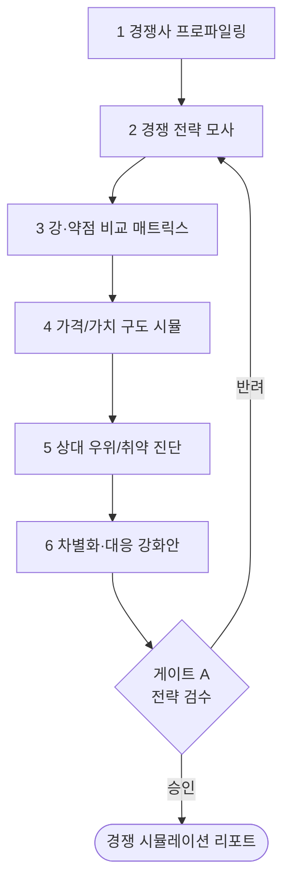

# 워크플로우: 경쟁사 시뮬레이션 (Competitor Simulation)

## 목적

같은 RFP에 입찰하는 **경쟁사의 제안 전략·강점·가격·차별화를 AI로 모사**하여, 우리 제안의 상대 우위·취약 구간을 사전 진단한다. AICompetitorSimulation(경쟁사 시뮬레이션) 체계로 경쟁 구도를 예측하고, 차별화 메시지와 방어/공격 포인트를 강화한다.

관련 GoldWiki: [`../GoldWiki/Research/README.md`](../GoldWiki/Research/README.md) (AICompetitorSimulation 정본 위치) · [`../GoldWiki/Industry/README.md`](../GoldWiki/Industry/README.md) · [`../GoldWiki/Proposal/AIEvaluationBoard.md`](../GoldWiki/Proposal/AIEvaluationBoard.md) · 번호형 [`../GoldWiki/05_PROPOSAL_STRATEGY.md`](../GoldWiki/05_PROPOSAL_STRATEGY.md) · [`../GoldWiki/36_REFERENCE_LIBRARY.md`](../GoldWiki/36_REFERENCE_LIBRARY.md)

## 시작 조건

- 우리 제안 전략([`01_RFP_to_Proposal.md`](01_RFP_to_Proposal.md) 7단계 산출)·win theme 확보.
- 예상 경쟁사 목록·시장 포지션·과거 수주 이력 확보.
- 업종 리서치·레퍼런스 라이브러리 접근.

## 참여 에이전트

| 에이전트 | 역할 |
| --- | --- |
| `client-simulation-lead` | 경쟁사 모사·시나리오·우위 분석 총괄 |
| `industry-research-lead` | 경쟁사 프로파일·시장 데이터 제공 |
| `product-strategy-lead` | 솔루션 차별화·기능 비교 |
| `proposal-lead` | 차별화 메시지·방어/공격 포인트 강화 |
| `business-analysis-lead` | 가격/원가 구도 시뮬 |
| `executive-director` | 전략 조정·게이트 승인 |

## 단계별 프로세스

| 단계 | 담당(R) | 입력 | 처리 | 출력 |
| --- | --- | --- | --- | --- |
| 1 프로파일링 | industry-research-lead | 경쟁사 목록·이력 | 경쟁사별 강점·포지션·전략 패턴 정리 | 경쟁사 프로파일 |
| 2 전략 모사 | client-simulation-lead | 프로파일·RFP | 경쟁사 관점 제안 전략 추론 | 경쟁 제안 시나리오 |
| 3 비교 매트릭스 | product-strategy-lead | 시나리오·우리 제안 | 항목별 강·약점 비교 | 경쟁 비교 매트릭스 |
| 4 가격/가치 시뮬 | business-analysis-lead | 원가·시장가 | 가격 구도·가치 포지션 시뮬 | 가격 구도 분석 |
| 5 우위/취약 진단 | client-simulation-lead | 3·4 산출 | 상대 우위·취약 구간 도출 | 우위/취약 진단서 |
| 6 차별화 강화안 | proposal-lead, executive-director | 진단서 | 차별화 메시지·방어/공격 포인트 | 대응 강화안 / 게이트 **A** |

## 입력 산출물

- 우리 제안 전략·win theme, 경쟁사 목록·이력, 업종 리서치, 레퍼런스 라이브러리, 가격/원가 기준.

## 중간 산출물

- 경쟁사 프로파일, 경쟁 제안 시나리오, 경쟁 비교 매트릭스, 가격 구도 분석, 우위/취약 진단서.

## 최종 산출물

- **경쟁사 시뮬레이션 리포트**(경쟁 구도 + 비교 매트릭스 + 차별화 강화안 + 방어/공격 포인트).
- 갱신: [`../GoldWiki/Research/README.md`](../GoldWiki/Research/README.md), [`../GoldWiki/36_REFERENCE_LIBRARY.md`](../GoldWiki/36_REFERENCE_LIBRARY.md), [`../GoldWiki/DecisionLog/README.md`](../GoldWiki/DecisionLog/README.md).

## 품질 게이트

| 게이트 | 위치 | 통과 조건 | 승인자 |
| --- | --- | --- | --- |
| A 전략 검수 | 6단계 후 | 주요 경쟁사 전부 모사, 취약 구간에 대응안 존재, 차별화 명확 | executive-director |

- 체크: 경쟁사별 시나리오 근거(레퍼런스), 우리 약점 정직 진단, 차별화가 평가기준에 연결됨. 기준: [`../GoldWiki/QA/QualityReviewChecklist.md`](../GoldWiki/QA/QualityReviewChecklist.md).

## 실패 시 복구 절차

1. **취약 구간 대응 불가:** 제안 전략으로 라우팅([`01_RFP_to_Proposal.md`](01_RFP_to_Proposal.md) 7단계), win theme 재정의 후 2단계 재시뮬.
2. **경쟁사 정보 부족:** 1단계 회귀, `industry-research-lead`가 레퍼런스 보강.
3. **가격 열위:** 가치 기반 포지셔닝으로 전환(4단계 재실행), DecisionLog 기록.
4. **고객 시뮬과 충돌:** [`07_Client_Simulation.md`](07_Client_Simulation.md) 결과와 교차 검토 후 통합 전략 조정.
5. 경쟁 인텔리전스는 [`../GoldWiki/36_REFERENCE_LIBRARY.md`](../GoldWiki/36_REFERENCE_LIBRARY.md)에 누적해 자산화한다.

## RACI 요약

| 구간 | R (실무) | A (승인) | C (자문) | I (통보) |
| --- | --- | --- | --- | --- |
| 1 프로파일링 | industry-research-lead | client-simulation-lead | — | 제안팀 |
| 2~3 모사·비교 | client-simulation-lead, product-strategy-lead | client-simulation-lead | industry-research-lead | — |
| 4~5 가격·진단 | business-analysis-lead | client-simulation-lead | product-strategy-lead | — |
| 6 강화(게이트 A) | proposal-lead | executive-director | client-simulation-lead | 전 팀 |

## 입출력 개요

| 단계군 | 핵심 입력 | 핵심 산출물 |
| --- | --- | --- |
| 1~3 | 경쟁사 정보·우리 제안 | 프로파일·시나리오·비교 매트릭스 |
| 4~5 | 시나리오·원가 | 가격 구도·우위/취약 진단 |
| 6 | 진단서 | 차별화·대응 강화안 |

## 거버넌스

경쟁사 시나리오는 추정이며 반드시 레퍼런스 근거를 부기한다. 결과는 [`07_Client_Simulation.md`](07_Client_Simulation.md)와 교차 검토하여 제안 전략([`01_RFP_to_Proposal.md`](01_RFP_to_Proposal.md))에 반영한다. 경쟁 인텔리전스·차별화 패턴은 [`../GoldWiki/Research/README.md`](../GoldWiki/Research/README.md)·[`../GoldWiki/36_REFERENCE_LIBRARY.md`](../GoldWiki/36_REFERENCE_LIBRARY.md)에 자산화한다. GoldWiki를 먼저 참조한다(SSOT).

## 비교 매트릭스 구조 (예시)

| 평가축 | 우리 제안 | 경쟁 A | 경쟁 B | 우위 판정 |
| --- | --- | --- | --- | --- |
| 전문성/레퍼런스 | (근거) | (추정) | (추정) | 우위/대등/열위 |
| 솔루션 차별화 | (근거) | (추정) | (추정) | — |
| 가격/가치 | (근거) | (추정) | (추정) | — |
| 수행 체계/일정 | (근거) | (추정) | (추정) | — |

> 열위 판정 축에는 6단계 대응 강화안(방어/공격 포인트)을 1:1로 연결해 공백을 남기지 않는다.
