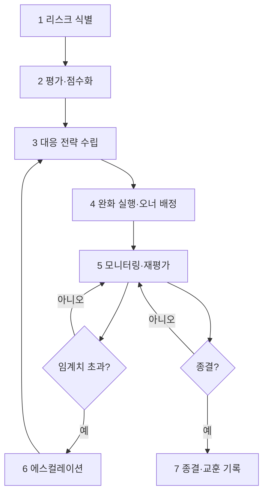

# 워크플로우: PMO 리스크 관리 (PMO Risk Management)

## 목적

프로젝트 전 생애주기에서 **리스크를 식별·평가·대응·모니터링**하는 상시 PMO 워크플로우다. WBS·일정·범위·품질·보안 리스크를 레지스터로 통합 관리하고, 임계치 초과 시 에스컬레이션·완화 조치를 발동하여 납기·품질·수익성을 보호한다.

관련 GoldWiki: [`../GoldWiki/PMO/README.md`](../GoldWiki/PMO/README.md) · [`../GoldWiki/PMO/WBSGuide.md`](../GoldWiki/PMO/WBSGuide.md) · [`../GoldWiki/Foundation/OperatingPrinciples.md`](../GoldWiki/Foundation/OperatingPrinciples.md) · 번호형 [`../GoldWiki/35_PROJECT_MEMORY.md`](../GoldWiki/35_PROJECT_MEMORY.md) · [`../GoldWiki/32_DECISION_LOG.md`](../GoldWiki/32_DECISION_LOG.md) · [`../GoldWiki/39_COMMON_ERRORS.md`](../GoldWiki/39_COMMON_ERRORS.md)

## 시작 조건

- 프로젝트 착수(WBS·일정·범위 정의) 또는 마일스톤 진입.
- 리스크 분류 체계·심각도/발생가능성 척도·에스컬레이션 기준 합의.
- 리스크 레지스터 초기화(과거 프로젝트 리스크 이관 포함).

## 참여 에이전트

| 에이전트 | 역할 |
| --- | --- |
| `pmo-director` | 리스크 관리 총괄·레지스터·에스컬레이션 결정 |
| `security-risk-lead` | 보안·개인정보·컴플라이언스 리스크 |
| `cto-reviewer` | 기술·아키텍처·구현 리스크 |
| `coo-operator` | 운영·자원·일정 리스크 |
| `business-analysis-lead` | 비용·수익성·범위 리스크 |
| `qa-lead` | 품질·결함 리스크 |
| `executive-director` | 고위험 에스컬레이션 승인 |
| `documentation-lead` | 레지스터·결정 GoldWiki 갱신 |

## 단계별 프로세스 (상시 루프)

1. **리스크 식별** — R: 전 리드 / 입력: WBS·산출물·외부 환경 / 출력: 리스크 후보 목록(분류·출처).
2. **평가·점수화** — R: `pmo-director` / 처리: 발생가능성×영향 매트릭스 → 우선순위 / 출력: 리스크 점수·등급.
3. **대응 전략 수립** — R: `pmo-director`, 도메인 리드 / 처리: 회피/전가/완화/수용 결정 / 출력: 대응 계획.
4. **완화 실행·오너 배정** — R: 도메인 리드 / 출력: 액션·오너·기한·트리거.
5. **모니터링·재평가** — R: `pmo-director`, `qa-lead` / 출력: 상태 갱신·잔여 리스크·KRI 추이.
6. **에스컬레이션** — R: `pmo-director`, `executive-director` / 임계치 초과 시 의사결정 상정 / 출력: 에스컬레이션 결정.
7. **종결·교훈 기록** — R: `documentation-lead` / 출력: 종결 사유·교훈, GoldWiki 갱신.

## 입력 산출물

- WBS·일정·범위 정의([`../GoldWiki/PMO/WBSGuide.md`](../GoldWiki/PMO/WBSGuide.md)), 산출물 현황, 외부/계약 조건, 과거 리스크 이력.

## 중간 산출물

- 리스크 후보 목록, 평가 매트릭스, 대응 계획, 완화 액션 트래커, 모니터링 대시보드(KRI).

## 최종 산출물

- **리스크 레지스터**(상시 유지, 식별~종결 전 이력) + 에스컬레이션 결정 로그 + 교훈 기록.
- 갱신: [`../GoldWiki/DecisionLog/README.md`](../GoldWiki/DecisionLog/README.md), [`../GoldWiki/ProjectMemory/README.md`](../GoldWiki/ProjectMemory/README.md), [`../GoldWiki/39_COMMON_ERRORS.md`](../GoldWiki/39_COMMON_ERRORS.md).

## 품질 게이트

| 게이트 | 위치 | 통과 조건 | 승인자 |
| --- | --- | --- | --- |
| 마일스톤 리스크 리뷰 | 각 마일스톤 | High 리스크 전부 대응 오너·기한 보유, 미해결 Critical 0 | pmo-director |
| 에스컬레이션 게이트 | 임계치 초과 시 | 의사결정·자원 승인 확보, 결정 DecisionLog 기록 | executive-director |

- 척도: 발생가능성(1~5)×영향(1~5) = 위험 점수. **15 이상 = High(에스컬레이션 후보)**, **20+ = Critical(즉시 상정)**.
- 기준: [`../GoldWiki/QA/QualityReviewChecklist.md`](../GoldWiki/QA/QualityReviewChecklist.md), [`../GoldWiki/24_SECURITY_GUIDE.md`](../GoldWiki/24_SECURITY_GUIDE.md).

## 실패 시 복구 절차

1. **리스크 현실화(이슈 전환):** 즉시 컨틴전시 발동, 영향 받은 워크플로우(01~06)에 재작업 라우팅, `pmo-director`가 일정 재계획.
2. **누락 리스크 발견:** 1단계로 회귀, 식별 체크리스트 보강 후 재평가. 패턴은 [`../GoldWiki/39_COMMON_ERRORS.md`](../GoldWiki/39_COMMON_ERRORS.md)에 등록.
3. **완화 미작동:** 대응 전략(3) 재수립, 대안 컨틴전시 적용, 오너 재배정.
4. **에스컬레이션 지연:** KRI 자동 트리거 강화, 임계 초과 즉시 `executive-director` 상정.
5. 모든 종결 리스크는 교훈으로 자산화하여 차기 프로젝트 식별 단계에 선반영한다.

## RACI 요약

| 구간 | R (실무) | A (승인) | C (자문) | I (통보) |
| --- | --- | --- | --- | --- |
| 1~2 식별·평가 | 전 도메인 리드 | pmo-director | qa-lead | 전 팀 |
| 3~4 대응·완화 | 도메인 리드 | pmo-director | security-risk-lead, cto-reviewer | 오너 |
| 5 모니터링 | pmo-director, qa-lead | pmo-director | coo-operator | 전 팀 |
| 6 에스컬레이션 | pmo-director | executive-director | business-analysis-lead | 전 팀 |
| 7 종결·교훈 | documentation-lead | pmo-director | — | 전 팀 |

## 입출력 개요

| 단계군 | 핵심 입력 | 핵심 산출물 |
| --- | --- | --- |
| 1~2 | WBS·산출물·환경 | 리스크 후보·평가 매트릭스 |
| 3~5 | 평가 결과 | 대응 계획·완화 트래커·KRI 대시보드 |
| 6~7 | 임계 초과·종결 | 에스컬레이션 결정·교훈 기록 |

## 거버넌스

리스크 레지스터는 프로젝트 전 생애주기 동안 유지되는 살아있는 문서다. 모든 에스컬레이션 결정은 [`../GoldWiki/DecisionLog/README.md`](../GoldWiki/DecisionLog/README.md)에, 종결 교훈은 [`../GoldWiki/ProjectMemory/README.md`](../GoldWiki/ProjectMemory/README.md)·[`../GoldWiki/39_COMMON_ERRORS.md`](../GoldWiki/39_COMMON_ERRORS.md)에 기록한다. 본 워크플로우는 전 단계 워크플로우([`01_RFP_to_Proposal.md`](01_RFP_to_Proposal.md)~[`10_Final_Delivery.md`](10_Final_Delivery.md))와 상시 연동되며, 품질 검증([`06_Project_QualityReview.md`](06_Project_QualityReview.md))의 결함을 리스크/이슈로 수용한다. GoldWiki를 먼저 참조한다(SSOT).
