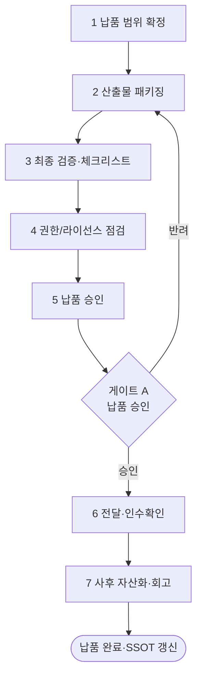

# 워크플로우: 최종 납품 (Final Delivery)

## 목적

품질 검증을 통과한 산출물을 **클라이언트에 정식 납품**하기까지의 마지막 게이트를 절차화한다. 납품물 패키징·검증·승인·전달·인수확인·사후 자산화(GoldWiki 갱신)를 일관되게 수행하여 누락·하자·분쟁을 방지한다. [`../GoldWiki/Delivery/FinalDeliveryChecklist.md`](../GoldWiki/Delivery/FinalDeliveryChecklist.md)를 정본 체크리스트로 사용한다.

관련 GoldWiki: [`../GoldWiki/Delivery/FinalDeliveryChecklist.md`](../GoldWiki/Delivery/FinalDeliveryChecklist.md) · [`../GoldWiki/Delivery/README.md`](../GoldWiki/Delivery/README.md) · [`../GoldWiki/Foundation/QualityStandard.md`](../GoldWiki/Foundation/QualityStandard.md) · 번호형 [`../GoldWiki/31_RELEASE_PROCESS.md`](../GoldWiki/31_RELEASE_PROCESS.md) · [`../GoldWiki/29_QUALITY_CHECKLIST.md`](../GoldWiki/29_QUALITY_CHECKLIST.md) · [`../GoldWiki/35_PROJECT_MEMORY.md`](../GoldWiki/35_PROJECT_MEMORY.md)

## 시작 조건

- [`06_Project_QualityReview.md`](06_Project_QualityReview.md) 품질 판정서 **Pass** 확보(Critical/Major 0).
- 계약상 납품 범위·형식·기한·인수 기준 확정.
- 납품 채널·접근 권한·라이선스/저작권 정리.

## 참여 에이전트

| 에이전트 | 역할 |
| --- | --- |
| `pmo-director` | 납품 일정·범위 정합·인수 조율 총괄 |
| `qa-lead` | 최종 납품 검증·체크리스트 판정 |
| `documentation-lead` | 납품 문서 정리·GoldWiki 자산화 |
| `security-risk-lead` | 권한·라이선스·개인정보 최종 점검 |
| `coo-operator` | 전달·운영 인계 실행 |
| `executive-director` | 최종 납품 승인(서명) |

## 단계별 프로세스

| 단계 | 담당(R) | 입력 | 처리 | 출력 |
| --- | --- | --- | --- | --- |
| 1 범위 확정 | pmo-director | 계약·산출물 | 납품 범위·형식·기준 대조 | 납품 명세서 |
| 2 패키징 | documentation-lead | 산출물 | 폴더 구조·버전·README·문서 정리 | 납품 패키지 |
| 3 최종 검증 | qa-lead | 패키지 | FinalDeliveryChecklist 전 항목 점검 | 검증 결과서 |
| 4 권한/라이선스 | security-risk-lead | 패키지 | 접근권한·라이선스·개인정보 점검 | 컴플라이언스 확인서 |
| 5 납품 승인 | executive-director | 1~4 산출 | 납품 가부 결정·서명 | 납품 승인서 / 게이트 **A** |
| 6 전달·인수확인 | coo-operator, pmo-director | 승인 패키지 | 클라이언트 전달·인수 서명 수령 | 인수확인서 |
| 7 사후 자산화 | documentation-lead, pmo-director | 납품 결과 | 회고·교훈·재사용 자산 GoldWiki 갱신 | 회고 보고·자산 |

## 입력 산출물

- 품질 판정서(Pass), 계약/SOW, 최종 산출물 전체, 라이선스/저작권 정보.

## 중간 산출물

- 납품 명세서, 납품 패키지, 검증 결과서, 컴플라이언스 확인서, 납품 승인서.

## 최종 산출물

- **납품 완료 패키지** + 인수확인서 + 회고 보고.
- 갱신: [`../GoldWiki/Delivery/FinalDeliveryChecklist.md`](../GoldWiki/Delivery/FinalDeliveryChecklist.md), [`../GoldWiki/ProjectMemory/README.md`](../GoldWiki/ProjectMemory/README.md), [`../GoldWiki/37_BEST_PRACTICES.md`](../GoldWiki/37_BEST_PRACTICES.md), [`../GoldWiki/DecisionLog/README.md`](../GoldWiki/DecisionLog/README.md).

## 품질 게이트

| 게이트 | 위치 | 통과 조건 | 승인자 |
| --- | --- | --- | --- |
| A 납품 승인 | 5단계 후 | 범위 100% 충족, FinalDeliveryChecklist 전 항목 Pass, 컴플라이언스 클리어 | executive-director |
| 인수 확인 | 6단계 후 | 클라이언트 인수 서명·하자 0(또는 합의 처리) | pmo-director |

- 정본 기준: [`../GoldWiki/Delivery/FinalDeliveryChecklist.md`](../GoldWiki/Delivery/FinalDeliveryChecklist.md), [`../GoldWiki/Foundation/QualityStandard.md`](../GoldWiki/Foundation/QualityStandard.md).
- 체크: 버전·파일 무결성, 문서 완비, 라이선스 명시, 접근권한 정확, 연락/지원 안내 포함.

## 실패 시 복구 절차

1. **검증/체크리스트 실패:** [`06_Project_QualityReview.md`](06_Project_QualityReview.md)로 라우팅, 결함 수정 후 3단계 재검증.
2. **범위 누락:** 1단계 회귀, 누락 산출물 보완·재패키징.
3. **컴플라이언스 이슈:** 납품 보류, `security-risk-lead` 조치 후 4단계 재점검, DecisionLog 기록.
4. **인수 거부/하자 제기:** `pmo-director`가 하자 등록 → [`09_PMO_RiskManagement.md`](09_PMO_RiskManagement.md) 이슈 전환, 수정·재납품 일정 합의.
5. 모든 납품 결과·하자·교훈은 [`../GoldWiki/39_COMMON_ERRORS.md`](../GoldWiki/39_COMMON_ERRORS.md)·ProjectMemory에 자산화하여 차기 납품 품질을 높인다.

## RACI 요약

| 구간 | R (실무) | A (승인) | C (자문) | I (통보) |
| --- | --- | --- | --- | --- |
| 1~2 범위·패키징 | pmo-director, documentation-lead | pmo-director | qa-lead | 전 팀 |
| 3~4 검증·컴플라이언스 | qa-lead, security-risk-lead | qa-lead | pmo-director | 엔지니어링 |
| 5 승인(게이트 A) | pmo-director | executive-director | qa-lead | 클라이언트 |
| 6 전달·인수 | coo-operator, pmo-director | pmo-director | executive-director | 클라이언트 |
| 7 자산화 | documentation-lead | pmo-director | qa-lead | 전 팀 |

## 입출력 개요

| 단계군 | 핵심 입력 | 핵심 산출물 |
| --- | --- | --- |
| 1~2 | 판정서·계약·산출물 | 납품 명세서·납품 패키지 |
| 3~5 | 패키지 | 검증 결과서·컴플라이언스 확인서·납품 승인서 |
| 6~7 | 승인 패키지 | 인수확인서·회고 보고·재사용 자산 |

## 거버넌스

납품은 품질 판정서 Pass([`06_Project_QualityReview.md`](06_Project_QualityReview.md)) 없이는 개시하지 않는다. 인수 거부·하자는 [`09_PMO_RiskManagement.md`](09_PMO_RiskManagement.md)로 이슈 전환한다. 납품 승인·인수 결과는 [`../GoldWiki/DecisionLog/README.md`](../GoldWiki/DecisionLog/README.md)에, 회고·재사용 자산은 [`../GoldWiki/ProjectMemory/README.md`](../GoldWiki/ProjectMemory/README.md)·[`../GoldWiki/37_BEST_PRACTICES.md`](../GoldWiki/37_BEST_PRACTICES.md)에 기록한다. GoldWiki를 먼저 참조한다(SSOT). 본 워크플로우가 RFP→납품 사이클의 종점이며, 회고 결과는 차기 사이클의 [`01_RFP_to_Proposal.md`](01_RFP_to_Proposal.md)에 선반영된다.
