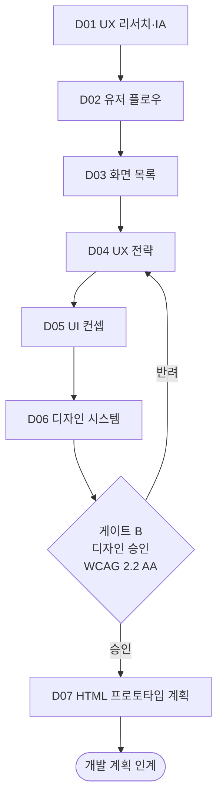

# 디자인 스프린트 런북

> 대응 실행 정의: [`.claude/workflows/design-sprint.md`](../.claude/workflows/design-sprint.md)
> 정본: [GoldWiki 09 디자인 시스템](../GoldWiki/09_DESIGN_SYSTEM.md), [GoldWiki 07 UX 원칙](../GoldWiki/07_UX_PRINCIPLES.md)
> 오케스트레이터: UX Researcher → UI Designer(단계별 리드 전환)

## 1. 목적

확정된 요구사항으로부터 **정보구조(IA) → 유저 플로우 → 화면 목록 → UX 전략 → UI 컨셉 → 디자인 시스템 → HTML 프로토타입 계획**까지 디자인 산출물을 완성하는 스프린트다. 게이트 B(디자인 승인) 통과 후 개발 계획([RFP→납품 런북](RFP_to_Delivery_Runbook.md) 단계 19) 또는 [delivery-qa](../.claude/workflows/delivery-qa.md)로 인계한다.

## 2. 사전조건

- 확정 요구사항(RFP→납품 단계 4 산출물) 확보.
- 브랜드 가이드·자산(`$BRAND`) 확인.
- [07 UX 원칙](../GoldWiki/07_UX_PRINCIPLES.md)·[08 UI 가이드](../GoldWiki/08_UI_GUIDELINES.md)·[09 디자인 시스템](../GoldWiki/09_DESIGN_SYSTEM.md)·[15 디자인 토큰](../GoldWiki/15_DESIGN_TOKEN.md)·[16 접근성](../GoldWiki/16_ACCESSIBILITY.md) 숙지.
- **중복 금지 원칙:** 기존 토큰·컴포넌트를 먼저 확인하고 재사용한다.

## 3. 단계 흐름도

## 4. 단계별 절차

### D01 · UX 리서치·정보구조(IA)

- **R:** UX Researcher, Service Planner / **A:** UX Researcher
- 사용자 리서치를 요약하고 사이트맵·콘텐츠 구조를 설계한다.
- 읽기: [07](../GoldWiki/07_UX_PRINCIPLES.md), [11](../GoldWiki/11_INFORMATION_ARCHITECTURE.md), [13](../GoldWiki/13_USER_JOURNEY.md) / 갱신: [11](../GoldWiki/11_INFORMATION_ARCHITECTURE.md), [13](../GoldWiki/13_USER_JOURNEY.md).

### D02 · 유저 플로우

- **R:** UX Researcher, Interaction Designer / **A:** UX Researcher
- 핵심 과업별 사용자 플로우 다이어그램을 작성한다.
- 읽기: [12](../GoldWiki/12_USER_FLOW.md) / 갱신: [12](../GoldWiki/12_USER_FLOW.md).

### D03 · 화면 목록

- **R:** Service Planner, UI Designer / **A:** UI Designer
- 화면 ID·명칭·목적·구성 요소를 담은 화면 정의서를 작성한다.
- 읽기: [08](../GoldWiki/08_UI_GUIDELINES.md) / 갱신: [11](../GoldWiki/11_INFORMATION_ARCHITECTURE.md).

### D04 · UX 전략

- **R:** UX Researcher / **A:** UX Researcher
- UX 원칙·핵심 경험·인터랙션 원칙을 정의한다.
- 읽기: [07](../GoldWiki/07_UX_PRINCIPLES.md), [13](../GoldWiki/13_USER_JOURNEY.md) / 갱신: [07](../GoldWiki/07_UX_PRINCIPLES.md).

### D05 · UI 컨셉

- **R:** UI Designer, BX Designer / **A:** UI Designer
- 비주얼 컨셉·무드보드·키 스크린 시안을 만든다.
- 읽기: [08](../GoldWiki/08_UI_GUIDELINES.md), [10](../GoldWiki/10_FIGMA_GUIDE.md) / 갱신: [08](../GoldWiki/08_UI_GUIDELINES.md).

### D06 · 디자인 시스템 → 게이트 B

- **R:** UI Designer, Interaction Designer, Accessibility Specialist / **A:** UI Lead + Project Director
- 컴포넌트·토큰·패턴을 정의하고 접근성 명세를 포함한다. 기존 토큰·컴포넌트는 재사용한다.
- 읽기: [09](../GoldWiki/09_DESIGN_SYSTEM.md), [14](../GoldWiki/14_COMPONENT_LIBRARY.md), [15](../GoldWiki/15_DESIGN_TOKEN.md), [16](../GoldWiki/16_ACCESSIBILITY.md) / 갱신: [09](../GoldWiki/09_DESIGN_SYSTEM.md), [14](../GoldWiki/14_COMPONENT_LIBRARY.md), [15](../GoldWiki/15_DESIGN_TOKEN.md).
- **게이트 B(디자인 승인):** 디자인 일관성·토큰 정합성·접근성(WCAG 2.2 AA). [29](../GoldWiki/29_QUALITY_CHECKLIST.md)의 UX·UI·디자인시스템·접근성 체크리스트 적용. 미통과 시 D04~D06 재작업.

### D07 · HTML 프로토타입 계획

- **R:** Publishing Engineer, Frontend Engineer / **A:** UI Lead
- 프로토타입 범위·구조·우선순위와 재사용 마크업 패턴을 계획한다.
- 읽기: [17](../GoldWiki/17_HTML_GUIDE.md), [18](../GoldWiki/18_CSS_GUIDE.md), [20](../GoldWiki/20_FRONTEND_GUIDE.md) / 갱신: [38](../GoldWiki/38_TEMPLATE_LIBRARY.md). 이후 개발 계획으로 인계.

## 5. RACI 요약

| 단계 | R | A | C | I |
| --- | --- | --- | --- | --- |
| D01~D02 | UX Researcher, Interaction Designer | UX Researcher | Service Planner | UI Designer |
| D03 | Service Planner, UI Designer | UI Designer | UX Researcher | 엔지니어링 |
| D04 | UX Researcher | UX Researcher | Interaction Designer | UI Designer |
| D05 | UI Designer, BX Designer | UI Designer | UX Researcher | Accessibility Specialist |
| D06 (게이트 B) | UI Designer, Interaction Designer, Accessibility Specialist | UI Lead+Project Director | Frontend Engineer | 엔지니어링 |
| D07 | Publishing Engineer, Frontend Engineer | UI Lead | UI Designer | QA |

## 6. 입출력 개요

| 단계 | 입력 | 산출물 |
| --- | --- | --- |
| D01~D03 | 확정 요구사항 | 리서치 요약, IA·사이트맵, 유저 플로우, 화면 정의서 |
| D04~D06 | 화면 목록, 브랜드 | UX 전략, UI 컨셉, 디자인 시스템(토큰·컴포넌트·접근성) |
| D07 | 디자인 시스템 | HTML 프로토타입 계획, 재사용 마크업 패턴 |

## 7. 품질 게이트 요약

| 게이트 | 위치 | 통과 조건 | 승인자 |
| --- | --- | --- | --- |
| B | D06 후 | 디자인 일관성·토큰 정합성·접근성(WCAG 2.2 AA) | UI Lead/Project Director |

접근성은 협상 대상이 아니며, 게이트 B의 필수 통과 조건이다.

## 관련 GoldWiki 문서

- [07_UX_PRINCIPLES.md](../GoldWiki/07_UX_PRINCIPLES.md) — UX 원칙
- [09_DESIGN_SYSTEM.md](../GoldWiki/09_DESIGN_SYSTEM.md) — 디자인 시스템 정본
- [14_COMPONENT_LIBRARY.md](../GoldWiki/14_COMPONENT_LIBRARY.md) — 컴포넌트 SSOT
- [15_DESIGN_TOKEN.md](../GoldWiki/15_DESIGN_TOKEN.md) — 디자인 토큰 SSOT
- [16_ACCESSIBILITY.md](../GoldWiki/16_ACCESSIBILITY.md) — 접근성 기준
- [29_QUALITY_CHECKLIST.md](../GoldWiki/29_QUALITY_CHECKLIST.md) — 게이트 B 체크리스트

> **거버넌스:** 본 런북 실행 중 발생한 모든 의사결정은 [의사결정 로그](../GoldWiki/32_DECISION_LOG.md), [프로젝트 메모리](../GoldWiki/35_PROJECT_MEMORY.md), [베스트 프랙티스](../GoldWiki/37_BEST_PRACTICES.md), [레퍼런스 라이브러리](../GoldWiki/36_REFERENCE_LIBRARY.md)를 갱신한다.
