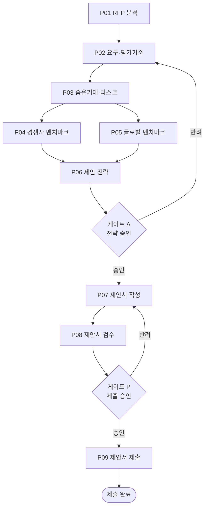

# 제안 스프린트 런북

> 대응 실행 정의: [`.claude/workflows/proposal-sprint.md`](../.claude/workflows/proposal-sprint.md)
> 정본: [GoldWiki 05 제안 전략](../GoldWiki/05_PROPOSAL_STRATEGY.md), [GoldWiki 03 RFP 프레임워크](../GoldWiki/03_RFP_FRAMEWORK.md)
> 오케스트레이터: Proposal Strategist

## 1. 목적

RFP는 수령했으나 수주가 확정되지 않은 상태에서, **RFP 분석부터 제안서 제출까지**를 단기간에 완결하는 스프린트다. RFP→납품 파이프라인의 전략 구간(S01~S10)을 압축하고, 제안서 작성·검수·제출 단계를 추가한다. 게이트 P(제출 승인) 통과로 종료되며, 수주 시 [RFP→납품 런북](RFP_to_Delivery_Runbook.md)의 WBS 단계로 이어진다.

## 2. 사전조건

- 원본 RFP와 제출 마감일(`$DUE_DATE`) 확인.
- [03 RFP 프레임워크](../GoldWiki/03_RFP_FRAMEWORK.md)·[05 제안 전략](../GoldWiki/05_PROPOSAL_STRATEGY.md) 숙지.
- 제안서 템플릿([38 템플릿 라이브러리](../GoldWiki/38_TEMPLATE_LIBRARY.md)) 확인.
- 게이트 승인자(Sales Director, Project Director, 필요 시 CEO) 일정 확보.

## 3. 단계 흐름도

## 4. 단계별 절차

### P01 · RFP 분석

- **R:** Business Analyst / **A:** Proposal Strategist
- RFP 정규화·구조 분석·1페이지 요약을 통합 산출한다(메타데이터: 발주처·예산·기한).
- 읽기: [03](../GoldWiki/03_RFP_FRAMEWORK.md), [04](../GoldWiki/04_RFP_ANALYSIS.md), [34](../GoldWiki/34_CLIENT_KNOWLEDGE.md) / 갱신: [04](../GoldWiki/04_RFP_ANALYSIS.md), [35](../GoldWiki/35_PROJECT_MEMORY.md).

### P02 · 요구사항·평가기준

- **R:** Business Analyst, Product Owner, Proposal Strategist / **A:** Proposal Strategist
- 요구사항을 ID·유형·우선순위·출처로 정리하고, 평가기준·배점 매트릭스에 우리 강점을 매핑한다.
- 갱신: [04](../GoldWiki/04_RFP_ANALYSIS.md), [05](../GoldWiki/05_PROPOSAL_STRATEGY.md).

### P03 · 숨은기대·리스크

- **R:** Proposal Strategist, Project Director / **A:** Proposal Strategist
- 명시되지 않은 기대·동기·정치적 맥락(CoT 추론, [26](../GoldWiki/26_PROMPT_ENGINEERING.md))과 리스크 레지스터를 함께 작성한다. 이후 P04·P05로 병렬 분기.
- 갱신: [05](../GoldWiki/05_PROPOSAL_STRATEGY.md), [34](../GoldWiki/34_CLIENT_KNOWLEDGE.md), [39](../GoldWiki/39_COMMON_ERRORS.md).

### P04·P05 · 벤치마크 (병렬)

- **P04 경쟁사:** R Business Analyst, Service Planner — 비교표·차별화.
- **P05 글로벌:** R Service Planner, UX Researcher — 우수 사례·표준 요약.
- 갱신: [36](../GoldWiki/36_REFERENCE_LIBRARY.md), [37](../GoldWiki/37_BEST_PRACTICES.md).

### P06 · 제안 전략 → 게이트 A

- **R:** Proposal Strategist, Sales Director / **A:** Sales Director + Project Director
- 수주 전략·핵심 메시지·win theme·가격 포지셔닝을 수립한다.
- **게이트 A(전략 승인):** 전략 정합성·수주 가능성·수익성. 미통과 시 P02~P06 재작업. 결정은 [32](../GoldWiki/32_DECISION_LOG.md)에 기록.

### P07 · 제안서 작성

- **R:** Proposal Strategist, Service Planner, Documentation Specialist / **A:** Project Director
- 요약·과업 이해도·수행방안·일정·조직·가격을 담은 제안서 초안을 작성한다. 템플릿([38](../GoldWiki/38_TEMPLATE_LIBRARY.md))과 프롬프트 라이브러리([40](../GoldWiki/40_PROMPT_LIBRARY.md))를 활용한다.

### P08 · 제안서 검수 → 게이트 P

- **R:** Project Director, Sales Director, Documentation Specialist / **A:** Sales Director
- 평가기준 매트릭스 대비 충족도를 점검하고, 오탈자·일관성·가격을 검수한다.
- **게이트 P(제출 승인):** 평가기준 전 항목 대응·일관성·가격 승인. 승인자 Sales/Project Director(+CEO). 미통과 시 P07로 회귀. [29](../GoldWiki/29_QUALITY_CHECKLIST.md) 적용.

### P09 · 제안서 제출

- **R:** Sales Director / **A:** Sales Director
- 마감 전 지정 채널로 제출하고 접수 확인을 기록한다.
- 갱신: [35](../GoldWiki/35_PROJECT_MEMORY.md), [37](../GoldWiki/37_BEST_PRACTICES.md). 수주 시 [RFP→납품 런북](RFP_to_Delivery_Runbook.md) 단계 11(WBS)로 인계.

## 5. RACI 요약

| 단계 | R | A | C | I |
| --- | --- | --- | --- | --- |
| P01~P03 | Business Analyst, Proposal Strategist | Proposal Strategist | Project Director | Sales |
| P04~P05 | Service Planner, BA, UX Researcher | Proposal Strategist | — | 디자인 |
| P06 (게이트 A) | Proposal Strategist, Sales Director | Sales+Project Director | CEO | 전 팀 |
| P07 | Proposal Strategist, Documentation Specialist | Project Director | Service Planner | Sales |
| P08 (게이트 P) | Project Director, Documentation Specialist | Sales Director | CEO | 전 팀 |
| P09 | Sales Director | Sales Director | Project Director | 클라이언트 |

## 6. 입출력 개요

| 단계 | 입력 | 산출물 |
| --- | --- | --- |
| P01~P03 | 원본 RFP, 클라이언트 지식 | 분석·요구사항·평가 매트릭스·숨은기대·리스크 |
| P04~P06 | 벤치마크 | 경쟁사/글로벌 벤치마크, 수주 전략 |
| P07~P09 | 승인된 전략 | 제안서 초안→최종, 검수 리포트, 제출 기록 |

## 7. 품질 게이트 요약

| 게이트 | 위치 | 통과 조건 | 승인자 |
| --- | --- | --- | --- |
| A | P06 후 | 전략 정합성·수주 가능성·수익성 | Sales/Project Director |
| P | P08 후 | 평가기준 충족·일관성·가격 승인 | Sales/Project Director(+CEO) |

## 관련 GoldWiki 문서

- [03_RFP_FRAMEWORK.md](../GoldWiki/03_RFP_FRAMEWORK.md) — RFP 분석 프레임워크
- [05_PROPOSAL_STRATEGY.md](../GoldWiki/05_PROPOSAL_STRATEGY.md) — 제안 전략 정본
- [04_RFP_ANALYSIS.md](../GoldWiki/04_RFP_ANALYSIS.md) — RFP 분석 산출
- [38_TEMPLATE_LIBRARY.md](../GoldWiki/38_TEMPLATE_LIBRARY.md) — 제안서 템플릿
- [29_QUALITY_CHECKLIST.md](../GoldWiki/29_QUALITY_CHECKLIST.md) — 제출 게이트 기준

> **거버넌스:** 본 런북 실행 중 발생한 모든 의사결정은 [의사결정 로그](../GoldWiki/32_DECISION_LOG.md), [프로젝트 메모리](../GoldWiki/35_PROJECT_MEMORY.md), [베스트 프랙티스](../GoldWiki/37_BEST_PRACTICES.md), [레퍼런스 라이브러리](../GoldWiki/36_REFERENCE_LIBRARY.md)를 갱신한다.
