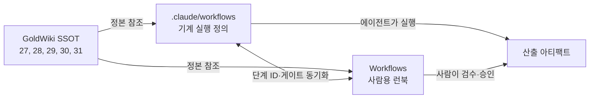

# Workflows — 워크플로우 런북 인덱스

ClubSchool AI OS의 업무는 표준 워크플로우로 운영된다. 이 디렉터리(`Workflows/`)는 **사람이 읽는 런북**을 담는다. 목적·사전조건·단계별 절차·역할(RACI)·입출력·품질 게이트·다이어그램을 통해, 누가 무엇을 어떤 순서로 수행하는지 한눈에 파악할 수 있다.

## 1. 런북 목록

| 런북 | 목적 | 대응 실행 정의 | 정본 GoldWiki |
| --- | --- | --- | --- |
| [RFP_to_Delivery_Runbook.md](RFP_to_Delivery_Runbook.md) | RFP 수령부터 납품까지 21단계 전체 파이프라인 | [`.claude/workflows/rfp-to-delivery.md`](../.claude/workflows/rfp-to-delivery.md) | [27](../GoldWiki/27_AUTOMATION_WORKFLOW.md) |
| [Proposal_Runbook.md](Proposal_Runbook.md) | RFP 분석~제안 제출 단기 스프린트 | [`.claude/workflows/proposal-sprint.md`](../.claude/workflows/proposal-sprint.md) | [05](../GoldWiki/05_PROPOSAL_STRATEGY.md) |
| [Design_Runbook.md](Design_Runbook.md) | UX 리서치~UI 컨셉~디자인 시스템~프로토타입 | [`.claude/workflows/design-sprint.md`](../.claude/workflows/design-sprint.md) | [09](../GoldWiki/09_DESIGN_SYSTEM.md) |
| (개발~QA~릴리스) | 구현·테스트·배포 | [`.claude/workflows/delivery-qa.md`](../.claude/workflows/delivery-qa.md) | [30](../GoldWiki/30_TEST_STRATEGY.md), [31](../GoldWiki/31_RELEASE_PROCESS.md) |

> 개발~QA~릴리스 절차의 기계 실행 정의는 [`delivery-qa`](../.claude/workflows/delivery-qa.md)에 있으며, 사람용 절차는 본 인덱스의 게이트 C/R 설명과 [30](../GoldWiki/30_TEST_STRATEGY.md)·[31](../GoldWiki/31_RELEASE_PROCESS.md)을 따른다.

## 2. `Workflows/`(런북)와 `.claude/workflows/`(실행 정의)의 관계

두 디렉터리는 같은 워크플로우를 서로 다른 독자에게 제공한다. **단일 진실 공급원은 항상 GoldWiki**이며, 두 디렉터리 모두 GoldWiki를 정본으로 링크할 뿐 지식을 복제하지 않는다.

| 구분 | `Workflows/` (이 디렉터리) | `.claude/workflows/` |
| --- | --- | --- |
| 독자 | 사람(PM·디자이너·엔지니어·경영진) | Claude Code 에이전트(기계 실행) |
| 형식 | 산문 절차 + RACI + mermaid | YAML 프론트매터 + 단계 표(ID·트리거·아티팩트) |
| 목적 | 이해·온보딩·협업 합의 | 자동 실행·인계·게이트 판정 |
| 변경 시 | 실행 정의와 단계 ID·게이트를 일치시킨다 | 런북과 단계 ID·게이트를 일치시킨다 |

## 3. 운영 방식

1. **시작:** 모든 작업은 [GoldWiki/00_START_HERE.md](../GoldWiki/00_START_HERE.md)에서 시작하고, 해당 작업에 맞는 워크플로우를 선택한다.
2. **선택 기준:**
   - RFP 전체 수행 → RFP_to_Delivery_Runbook
   - 제안만(수주 전) → Proposal_Runbook
   - 디자인 산출물만 → Design_Runbook
   - 구현~릴리스 → delivery-qa 실행 정의 + 게이트 C/R
3. **실행:** 에이전트는 `.claude/workflows/`의 정의를, 사람은 본 런북을 따른다. 단계 ID(예: `S10`, `P06`, `D06`, `Q05`)는 양쪽이 동일하다.
4. **게이트:** 각 게이트(A/B/C/R/P/최종)는 지정 승인자의 승인 없이 통과할 수 없다. 미통과 시 롤백 대상 단계로 회귀한다.
5. **거버넌스:** 모든 의사결정은 [의사결정 로그](../GoldWiki/32_DECISION_LOG.md)·[프로젝트 메모리](../GoldWiki/35_PROJECT_MEMORY.md)·[베스트 프랙티스](../GoldWiki/37_BEST_PRACTICES.md)·[레퍼런스 라이브러리](../GoldWiki/36_REFERENCE_LIBRARY.md)를 갱신한다.

## 4. 공통 RACI 범례

| 약어 | 의미 |
| --- | --- |
| R (Responsible) | 실제 수행 담당 |
| A (Accountable) | 최종 책임·승인 |
| C (Consulted) | 사전 협의 대상 |
| I (Informed) | 결과 통보 대상 |

## 5. 게이트 전체 지도

| 게이트 | 워크플로우 | 위치 | 승인자(A) |
| --- | --- | --- | --- |
| A 전략 승인 | RFP→납품, 제안 | S10 / P06 후 | Sales/Project Director |
| P 제안 제출 | 제안 | P08 후 | Sales/Project Director(+CEO) |
| B 디자인 승인 | RFP→납품, 디자인 | S17 / D06 후 | UI Lead/Project Director |
| C 품질 검수 | RFP→납품, 개발~QA | S20 / Q05 후 | QA/Project Director |
| R 릴리스 승인 | 개발~QA | Q06 후 | Project Director/DevOps |
| 최종 | RFP→납품 | S21 후 | Project Director(+CEO) |

## 관련 GoldWiki 문서

- [27_AUTOMATION_WORKFLOW.md](../GoldWiki/27_AUTOMATION_WORKFLOW.md) — 21단계 파이프라인 정본
- [28_SUBAGENT_RULES.md](../GoldWiki/28_SUBAGENT_RULES.md) — 에이전트 거버넌스
- [29_QUALITY_CHECKLIST.md](../GoldWiki/29_QUALITY_CHECKLIST.md) — 게이트 품질 기준
- [25_AI_GUIDE.md](../GoldWiki/25_AI_GUIDE.md) — 오케스트레이션·휴먼인더루프

> **거버넌스:** 본 문서의 모든 의사결정은 [의사결정 로그](../GoldWiki/32_DECISION_LOG.md), [프로젝트 메모리](../GoldWiki/35_PROJECT_MEMORY.md), [베스트 프랙티스](../GoldWiki/37_BEST_PRACTICES.md), [레퍼런스 라이브러리](../GoldWiki/36_REFERENCE_LIBRARY.md)를 갱신한다.
