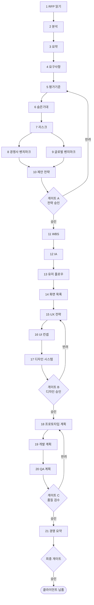

# RFP → 납품 런북 (21단계 전체 파이프라인)

> 대응 실행 정의: [`.claude/workflows/rfp-to-delivery.md`](../.claude/workflows/rfp-to-delivery.md)
> 정본: [GoldWiki 27 자동화 워크플로우](../GoldWiki/27_AUTOMATION_WORKFLOW.md)
> 오케스트레이터: Project Director

## 1. 목적

RFP 한 건을 받아 **클라이언트 납품물과 경영 요약**까지 자율적으로 생산하는 21단계 파이프라인을 사람이 따라가며 검수·승인할 수 있도록 절차화한다. 각 단계는 GoldWiki를 먼저 읽고, 산출 후 GoldWiki를 갱신하며, 세 개의 핵심 게이트(A·B·C)와 최종 게이트를 통과해야 다음으로 진행한다.

## 2. 사전조건

- 원본 RFP 문서(PDF/문서)와 클라이언트 배경 정보 확보.
- [GoldWiki/00_START_HERE.md](../GoldWiki/00_START_HERE.md)와 [27](../GoldWiki/27_AUTOMATION_WORKFLOW.md)를 숙지.
- 프로젝트 식별자(`$PROJECT_ID`)와 작업 디렉터리(`$WORKDIR`) 지정.
- 게이트 승인자(Sales Director, UI Lead, QA Lead, Project Director) 가용성 확인.

## 3. 단계 흐름도

## 4. 단계별 절차

각 단계는 **(1) GoldWiki 읽기 → (2) 수행 → (3) 산출물 생성 → (4) GoldWiki 갱신 → (5) 인계**의 5동작을 따른다. 산출물 파일명·읽기/갱신 문서의 정확한 목록은 실행 정의([rfp-to-delivery](../.claude/workflows/rfp-to-delivery.md))를 정본으로 한다.

### 단계 1~3 · RFP 흡수 (읽기·분석·요약)

- **R:** Business Analyst / **A:** Project Director / **C:** Proposal Strategist
- 원본 RFP를 정규화하고(메타데이터: 발주처·예산·기한), 범위·목표·제약·이해관계자를 구조 분석한 뒤 1페이지 요약으로 압축한다.
- 입력: 원본 RFP / 출력: 정규화 텍스트, 구조 분석, 1페이지 요약.
- 읽기: [03](../GoldWiki/03_RFP_FRAMEWORK.md), [06](../GoldWiki/06_BUSINESS_ANALYSIS.md), [34](../GoldWiki/34_CLIENT_KNOWLEDGE.md) / 갱신: [04](../GoldWiki/04_RFP_ANALYSIS.md), [35](../GoldWiki/35_PROJECT_MEMORY.md).

### 단계 4~6 · 요구·기준·기대 추출

- **R:** Business Analyst, Product Owner, Proposal Strategist / **A:** Project Director
- 요구사항을 ID·유형·우선순위·출처로 구조화하고, RFP 평가기준·배점을 매트릭스로 정리해 우리 강점을 매핑한다. 명시되지 않은 숨은 기대·동기·정치적 맥락을 CoT 추론([26](../GoldWiki/26_PROMPT_ENGINEERING.md))으로 식별한다.
- 출력: 요구사항 JSON, 평가기준 매트릭스, 숨은기대 분석.

### 단계 7 · 리스크 분석

- **R:** Project Director, Business Analyst / **A:** Project Director
- 발생가능성·영향·대응을 담은 리스크 레지스터를 작성한다. 이후 단계 8·9로 **병렬 분기**한다.
- 갱신: [35](../GoldWiki/35_PROJECT_MEMORY.md), [39](../GoldWiki/39_COMMON_ERRORS.md).

### 단계 8·9 · 벤치마크 (병렬)

- **8 경쟁사:** R Business Analyst, Service Planner — 비교표·차별화 포인트.
- **9 글로벌 베스트프랙티스:** R Service Planner, UX Researcher — 업계 패턴·표준(WCAG 등) 요약.
- 두 산출물은 단계 10에서 합류한다. 갱신: [36](../GoldWiki/36_REFERENCE_LIBRARY.md), [37](../GoldWiki/37_BEST_PRACTICES.md).

### 단계 10 · 제안 전략 → 게이트 A

- **R:** Proposal Strategist, Sales Director / **A:** Sales Director + Project Director
- 평가기준·숨은기대·벤치마크를 종합해 수주 전략·핵심 메시지·win theme를 수립한다.
- **품질 게이트 A(전략 승인):** 전략 정합성·수주 가능성. 미통과 시 단계 5~10 재작업. 결정은 [32](../GoldWiki/32_DECISION_LOG.md)에 기록.

### 단계 11~14 · 구조 설계 (WBS·IA·플로우·화면)

- **R:** Project Director(WBS), UX Researcher·Service Planner(IA·플로우), UI Designer(화면)
- WBS·일정·담당 매핑 → 사이트맵 → 사용자 플로우 → 화면 정의서를 순차 산출한다.
- 읽기: [11](../GoldWiki/11_INFORMATION_ARCHITECTURE.md), [12](../GoldWiki/12_USER_FLOW.md), [13](../GoldWiki/13_USER_JOURNEY.md), [08](../GoldWiki/08_UI_GUIDELINES.md).

### 단계 15~17 · 디자인 (UX 전략·UI 컨셉·디자인 시스템) → 게이트 B

- **R:** UX Researcher → UI Designer, BX Designer → +Interaction Designer, Accessibility Specialist
- UX 원칙·핵심 경험 → 비주얼 컨셉·키 스크린 → 컴포넌트·토큰·패턴(접근성 포함)으로 발전시킨다. 기존 토큰·컴포넌트는 재사용한다(중복 금지).
- **품질 게이트 B(디자인 승인):** 디자인 일관성·접근성(WCAG 2.2 AA). [29](../GoldWiki/29_QUALITY_CHECKLIST.md)의 UX·UI·디자인시스템·접근성 체크리스트 적용. 미통과 시 단계 15~17 재작업.

### 단계 18~20 · 빌드 계획 (프로토타입·개발·QA) → 게이트 C

- **R:** Publishing/Frontend(프로토타입), Frontend·Backend·API·DB(개발), QA·Security(QA)
- 프로토타입 범위·구조 → 아키텍처·API 계약·데이터 모델·개발 일정 → 테스트 전략·케이스·종료기준을 산출한다.
- **품질 게이트 C(품질 검수):** [30](../GoldWiki/30_TEST_STRATEGY.md) 종료기준 + [29](../GoldWiki/29_QUALITY_CHECKLIST.md) DoD. 미통과 시 단계 18~20 재작업. 실제 구현·테스트·릴리스는 [delivery-qa](../.claude/workflows/delivery-qa.md)로 이어 실행한다.

### 단계 21 · 경영 요약 → 최종 게이트

- **R:** Project Director / **A:** Project Director + CEO
- 전 단계 산출물을 1~2페이지 경영진·클라이언트용 요약으로 압축한다.
- **최종 게이트:** 경영 승인·클라이언트 준비. 통과 시 클라이언트 납품. 갱신: [35](../GoldWiki/35_PROJECT_MEMORY.md), [37](../GoldWiki/37_BEST_PRACTICES.md).

## 5. RACI 요약

| 구간 | R | A | C | I |
| --- | --- | --- | --- | --- |
| 1~3 흡수 | Business Analyst | Project Director | Proposal Strategist | 전 팀 |
| 4~6 요구·기준 | BA, Product Owner, Proposal Strategist | Project Director | Sales Director | UX |
| 7~9 리스크·벤치마크 | BA, Service Planner, UX Researcher | Project Director | Sales Director | 디자인 |
| 10 전략(게이트 A) | Proposal Strategist | Sales+Project Director | CEO | 전 팀 |
| 11~14 구조 | UX Researcher, Service Planner, UI Designer | Project Director | Interaction Designer | 엔지니어링 |
| 15~17 디자인(게이트 B) | UI Designer, BX Designer | UI Lead+Project Director | Accessibility Specialist | 엔지니어링 |
| 18~20 빌드(게이트 C) | FE/BE/API/DB, QA, Security | QA+Project Director | DevOps | 전 팀 |
| 21 경영요약(최종) | Project Director | Project Director+CEO | Sales Director | 클라이언트 |

## 6. 입출력 개요

| 단계군 | 핵심 입력 | 핵심 산출물 |
| --- | --- | --- |
| 1~3 | 원본 RFP | 정규화 RFP, 구조 분석, 1페이지 요약 |
| 4~10 | 요약·요구사항 | 요구사항 JSON, 평가 매트릭스, 리스크 레지스터, 벤치마크, 수주 전략 |
| 11~17 | 전략·요구사항 | WBS, IA, 플로우, 화면 정의서, UX/UI, 디자인 시스템 |
| 18~21 | 디자인·요구사항 | 프로토타입 계획, 개발 계획, QA 계획, 경영 요약 |

## 7. 품질 게이트 요약

| 게이트 | 위치 | 통과 조건 | 승인자 | 롤백 |
| --- | --- | --- | --- | --- |
| A | 단계 10 후 | 전략 정합성·수주 가능성 | Sales/Project Director | 5~10 |
| B | 단계 17 후 | 디자인 일관성·접근성 | UI Lead/Project Director | 15~17 |
| C | 단계 20 후 | 테스트 종료기준·DoD | QA/Project Director | 18~20 |
| 최종 | 단계 21 후 | 경영 승인·클라이언트 준비 | Project Director(+CEO) | — |

롤백 사유는 [공통 오류](../GoldWiki/39_COMMON_ERRORS.md)에 누적 기록한다.

## 관련 GoldWiki 문서

- [27_AUTOMATION_WORKFLOW.md](../GoldWiki/27_AUTOMATION_WORKFLOW.md) — 21단계 정본
- [25_AI_GUIDE.md](../GoldWiki/25_AI_GUIDE.md) — 오케스트레이션·게이트
- [29_QUALITY_CHECKLIST.md](../GoldWiki/29_QUALITY_CHECKLIST.md) — 게이트 기준
- [05_PROPOSAL_STRATEGY.md](../GoldWiki/05_PROPOSAL_STRATEGY.md) — 제안 전략

> **거버넌스:** 본 런북 실행 중 발생한 모든 의사결정은 [의사결정 로그](../GoldWiki/32_DECISION_LOG.md), [프로젝트 메모리](../GoldWiki/35_PROJECT_MEMORY.md), [베스트 프랙티스](../GoldWiki/37_BEST_PRACTICES.md), [레퍼런스 라이브러리](../GoldWiki/36_REFERENCE_LIBRARY.md)를 갱신한다.
